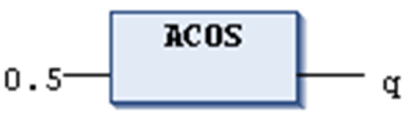

# `ACOS`

## Definition

Numeric IEC operator for returning the arc cosine (inverse function of cosine) of a number. The value is calculated in arch minutes.

The input variable can be of any numeric data type where the output variable has to be type REAL or LREAL.

## Example in IL

The result in `q` is 1.0472.

```
LD                0.5
ACOS
ST                q
```

## Example in ST

```
q:=ACOS(0.5);
```

## Example in FBD



EIO0000002854.09