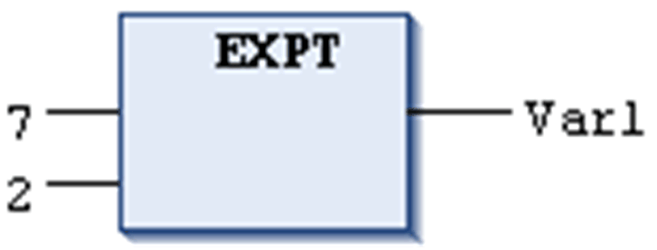

# `EXPT`

## Definition

Numeric IEC operator for exponentiation of a variable with another variable:

OUT = IN1 to the IN2

The input variable can be of numeric data types (SINT, USINT, INT, UINT, DINT, UDINT, LINT, ULINT, REAL, LREAL, BYTE, WORD, DWORD, and LWORD) where the output variable has to be type REAL or LREAL.

The result of this function is not defined if the following applies:

* The base is negative.
* The base is zero and the exponent is ≤ 0.

The behavior for such input values is platform-dependent.

## Example in IL

The result is 49.

```
LD                7
EXPT              2
ST                Var1
```

## Example in ST

```
var1:=EXPT(7,2);
```

## Example in FBD



EIO0000002854.09