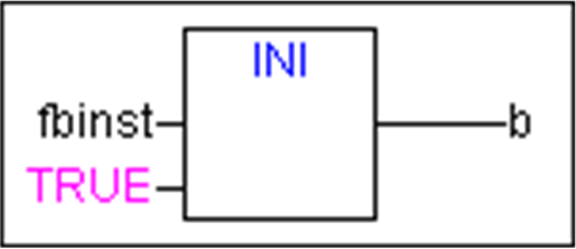

# INI Operator

## Overview

You can use the `INI` operator to initialize retain variables which are provided by a function block instance used in the POU.

Assign the operator to a boolean variable.

NOTE: The `INI` operator is obsolete. The method `FB_init` replaces the `INI` operator. For further information about the `FB_init` method, refer to the chapter [FB\_init, FB\_reinit Methods](D-SE-0083611.html#D-SE-0083611__D-SE-0083611.2). However, the operator can still be used for keeping compatibility with projects imported from earlier EcoStruxure Machine Expert versions.

## Syntax

<bool-variable> := INI(<FB-instance, TRUE|FALSE)

If the second parameter of the operator is set to TRUE, all retain variables defined in the function block FB will be initialized.

## Example in ST

fbinst is the instance of function block fb, in which a retain variable retvar is defined.

Declaration in POU

```
fbinst:fb;
b:bool;
```

Implementation part

```
b := INI(fbinst, TRUE);
ivar:=fbinst.retvar (* => retvar gets initialized *)
```

## Example of Operator Call in FBD



EIO0000002854.09