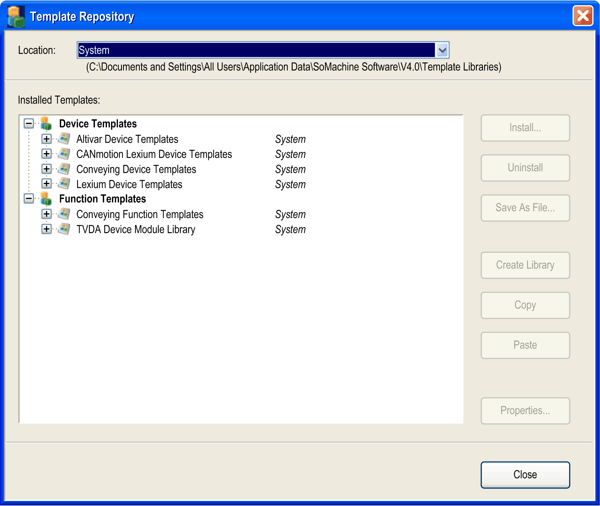
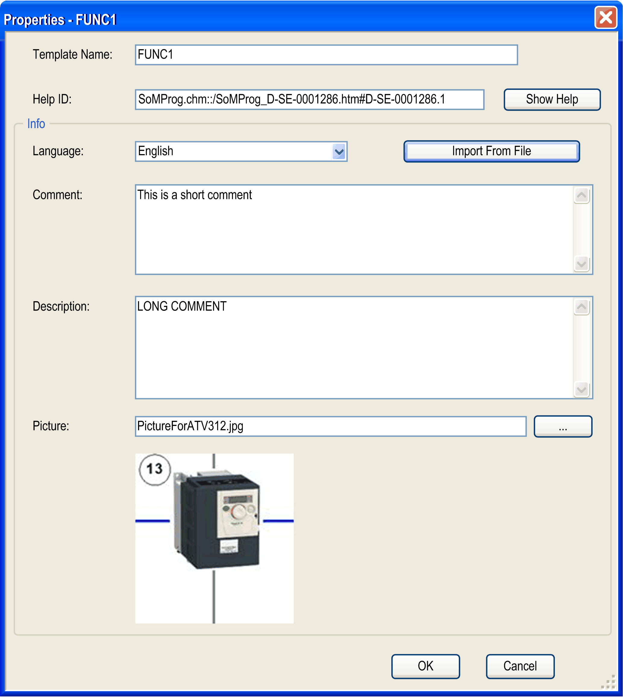

# Administration of Templates

## Overview

The following paragraphs provide an overview of how to create new or change existing device or function templates and to save them as files for transferring them to other PCs.

## Template Libraries

Template libraries contain the definition of several device or function templates.

## Write Protection

The standard template libraries included in the scope of delivery are write-protected, which means that they cannot be deleted or renamed.

NOTE: You cannot change write-protected libraries (uninstalling individual templates or changing names), but you can completely uninstall them.

## Template Administration

For administration of the available device and function templates, select Tools > Template Repository in the Logic Builder.

The Template Repository dialog box opens:



From the Location list, select the type of templates to be displayed in the Installed Templates box:

* <All locations> is selected by default: all available device and function templates are displayed
* Legacy displays the device and function templates of EcoStruxure Machine Expert V3.1 (if installed)
* User: displays only those device and function templates that you have created or installed
* System: displays the standard device and function templates delivered by EcoStruxure Machine Expert

The path to the directory where the template libraries are stored is displayed below the Location field.

The Installed Templates box lists the installed templates in 2 groups: Device Templates and Function Templates. Each template library can either contain device templates or function templates.

## Installing Additional Template Libraries

To add additional template libraries to this list, proceed as follows:

| Step | Action |
| --- | --- |
| 1 | Click the Install button in the Template Repository dialog box.  **Result**: A File open dialog box opens. |
| 2 | Browse to the folder where the template library file you want to install is saved. |
| 3 | Select the library file you want to install and click OK.  **Result**: The selected template library is installed and is indicated in the Template Repository dialog box, including the device or function templates it contains. |

## Removing Template Libraries

To remove a template library, proceed as follows:

| Step | Action |
| --- | --- |
| 1 | In the Installed Templates list of the Template Repository dialog box, select the template library you want to remove. |
| 2 | To remove the selected template library, click the Uninstall button.  **Result**: The selected template library is removed from the installation. |

## Renaming Template Libraries

To rename a template library, proceed as follows:

| Step | Action |
| --- | --- |
| 1 | In the Installed Templates list of the Template Repository dialog box, select the template library you want to rename. |
| 2 | Click the name of the template library you want to change.  **Result**: A box opens. |
| 3 | Enter the new name in the box and press Enter or leave the box.  **Result**: The template library is now assigned to the new name. |

## Creating a New Template Library

To create a new template library, proceed as follows:

| Step | Action |
| --- | --- |
| 1 | To create a new template library, select the option User or <All locations> from the Location list. |
| 2 | To create a new template library for device templates, select the Device Templates node in the Installed Templates list and click the Create Library button.  **Result**: A new template library with a default name is added at the bottom of the Device Templates section of the Installed Templates list.  To create a new template library for function templates, select the Function Templates node in the Installed Templates list and click the Create Library button.  **Result**: A new template library with a default name is added at the bottom of the Function Templates section of the Installed Templates list. |
| 3 | Rename the new template library as stated above and fill it with device or function templates by using for example the copy and paste operations described below. |

## Saving Template Libraries as File

The template libraries that contain device or function templates are EcoStruxure Machine Expert-specific XML files.

To provide them for use on other PCs, proceed as follows:

| Step | Action |
| --- | --- |
| 1 | Select the template library you want to export in the Installed Templates list. |
| 2 | Click the Save As File... button. |
| 3 | In the Save File dialog box, navigate to the folder where you want to save the template library file. |
| 4 | Transfer the template library file to the other PC and install it by using the Template Repository. |

## Copy and Paste Operations for Template Libraries

The Template Repository dialog box also supports the copy and paste operation for template libraries.

To copy a template library with the device or function template it contains, select the respective item in the Installed Templates list and click the Copy button.

Now select the Device Templates or Function Templates node, and click the Paste button to insert a copy of this template library with a default name in the Installed Templates list.

Replace the default name by a name of your choice.

## Copy and Paste Operations for Templates

The Template Repository dialog box supports the copy and paste operation for device or function templates.

To copy a device or function template, select the respective item from below a template library node in the Installed Templates list and click the Copy button.

You can now paste the template into a template library if the library is not write-protected.

A library can only be pasted into a library of the same kind.

Replace the default name, if you wish, by a name of your choice.

## Adding Further Information for Templates or Template Libraries

The Template Repository dialog box allows you to enter further information for templates or template libraries.

To add further information, select a library or template library in the Installed Templates list and click the Properties... button.

The Properties dialog box for the selected library or template library is displayed.



If the selected library or template library is not write-protected, the Properties dialog box contains the following parameters that you can edit, along with their corresponding buttons:

| Element | | Description |
| --- | --- | --- |
| Template Name / Library Name box | | Indicates the name of the library or template library these properties apply to. To change the name, click this box and adapt the name according to your requirements. |
| Help ID box | | For Schneider Electric templates or template libraries, contains the reference to the respective description in the online help.  If there is an online help document available for your templates, you can enter a full reference to its location in the online help or a keyword corresponding to an index in the online help. |
| Show Help button | | Opens the online help document specified in the Help ID box or the index of the online help searching for the keyword specified in the Help ID box. |
| Info section | | – |
|  | Language list | Contains the languages that are available for the graphical user interface of EcoStruxure Machine Expert. If you select a language, the content of the language-dependent elements Comment, Description, and Picture is displayed in the selected language.  If no language-specific content is available, the default language English is displayed. |
|  | Import From File button | Displays a standard Open dialog box. It allows you to browse for an XML file that contains the localized content of the language-dependent elements Comment, Description, and Picture. The structure of this XML file must follow the structure indicated in the [example](#D-SE-0083787__D-SE-0083787.29). |
|  | Comment box | Allows you to enter a short text (for example to provide an overview of the contents and purpose of the selected library or template library). This text is indicated as a tooltip when you select template libraries. |
|  | Description box | Allows you to enter a long text (for example to provide a detailed description of the contents and purpose of the selected library or template library. |
|  | Picture parameter  ... button | Allows you to enter a path to a language-specific picture.  You can also click the ... button to browse for the graphic file.  Supported graphic formats:   * Bitmap: *\*.bmp* * JPEG: *\*.jpg* * Graphics interchange format: *\*.gif* * Icon: *\*.ico*   After the picture has been specified, it will be displayed in the Properties dialog box.  If you click the OK button, the picture is embedded in the template. |

The check box Read-Only is only available for template libraries to indicate whether the selected template library is in read-only status. It is not possible to change the status of the template library here.

## Localization of Language-Dependent Elements

You can localize the content of the language-dependent elements Comment, Description, and Picture by importing an XML file with the following structure:

```
<?xml version="1.0" encoding="UTF-8"?>
<TemplateProperties>
<HelpId>SoMProg.chm::/SoMProg_D-SE-0001286.htm#D-SE-0001286.1</HelpId>
<PropertySet languageId = "en">
<Comment>This is a short description</Comment>
<Description>This is a long description</Description>
<ImageFile>PictureEnglish.jpg</ImageFile>
</PropertySet>
<PropertySet languageId = "de">
<Comment>Kurze Beschreibung</Comment>
<Description>Lange Beschreibung</Description>
<ImageFile>PictureGerman.jpg</ImageFile>
</PropertySet>
</TemplateProperties>
```

EIO0000002854.09