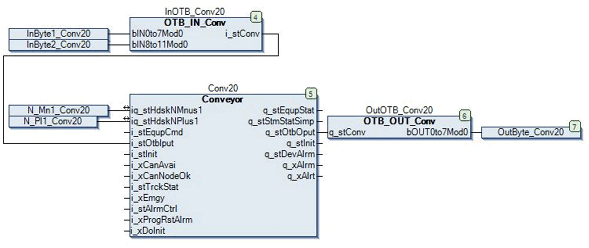

# Further Information on Integrating Control Logic into Device Templates

## Overview

You can include control logic into a device template if the logic contains one or more code sections that exchange data with the field device in one of the following ways:

* A code section uses a new variable that is defined in the I/O mapping of the field device.
* A code section and the I/O mapping of the field device use a common variable that is defined in a GVL or a controller program contained by the application to which the code section belongs.

  NOTE: If you use structures or arrays, verify that they are only related to a single field device.
* A code section and the field device use a fix device-specific variable (for example the axis-ref variables used with the Altivar or Lexium drives).

## Interconnected Calls of Code Sections

Code sections consist of a sequence of interconnected calls of function blocks, functions, and operators.

If one of the following relationships exists between the individual calls, they are considered as being connected:

* a graphical connection exists between the individual calls in CFC, FBD, and LD
* a variable is connected to the output of the one call and the input of the other call
* One call uses the parameter of the other call

## Individually Selecting Function Blocks

You can individually select the function blocks that are included in those code sections that exchange data with the field device to be included in the device template. This allows you to create different device templates providing different functions for the same field device.

NOTE: The function block type must be defined in a library.

## Including Expressions into Device Templates

The expressions, as well as the variables used in these expressions that are connected to the parameters of a function block, function or operator are automatically saved in the device template.

## General Practices for the Creation of Control Logic

If you create a device template in one IEC language, but instantiate it within a different IEC language, the result may be a difference in execution. Therefore, it is best to keep such control logic as simple as possible.

By keeping the logic as simple as possible, the code sections will likely work identically even if they are created in different IEC languages.

NOTE: For complex control logic, you should rather create a function template.

## Practices for the Creation of Control Logic in FBD / LD

Avoid edge detection elements because they do not exist in other IEC languages.

If possible, use `R_TRIG` or `F_TRIG` function blocks instead.

## Practices for the Creation of Control Logic in CFC

Use the command Execution Order > Order By Data Flow to order the CFC elements belonging to the same code section according to their position in the data flow. This provides a better compatibility with other IEC languages.

Provide space (in horizontal direction) between the individual CFC elements because, due to renaming, the names of variables are extended when a new device is created from a template.

## Control Logic Example

The following figure shows a typical example of a code section for an Advantys OTB distributed I/O device in a conveying application:

The code section consists of the following function blocks:

| Name | Type | Function |
| --- | --- | --- |
| `InOTB_Conv20` | Input block | Converting data coming from the OTB into the format required by the control block |
| `Conv20` | Control block | Processing data |
| `OutOTB_Conv20` | Output block | Converting data coming from the control block into the format required by the OTB |

The variables `InByte1_Conv20`, `InByte2_Conv20` and `OutByte_Conv20` are defined in the I/O mapping of the OTB. Therefore, the code section exchanges data with the OTB device. It can thus become part of the device template.

EIO0000002854.09