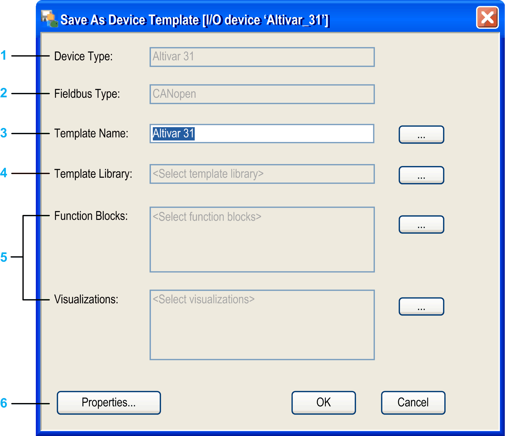

# Steps to Create a Device Template

## Overview

The following paragraphs list the steps that have to be performed in order to save field devices meeting the criteria stated in [*Creating a Device Template on the Basis of Field Devices*](D-SE-0083792.html#D-SE-0083792).

## Steps for Saving a Field Device as Template

To save an already existing field device as device template, proceed as follows:

| Step | Action |
| --- | --- |
| 1 | Right-click the field device you want to save as device template in the Devices tree. |
| 2 | Select the command Save As Device Template from the contextual menu.  **Result**: The application is automatically built. After the built process has been successfully completed, the Save as Device Template dialog box will be displayed. |
| 3 | Define the new device template in the Save as Device Template dialog box as stated below. |
| 4 | Click OK to close the Save as Device Template dialog box and to create your new device template. |

## Save As Device Template Dialog Box

The Save As Device Template dialog box contains the following parameters:

**1** indicates the type of the field device on which the device template is based

**2** indicates the fieldbus type of the field device

**3** the name of the device template that will be created (initially the name of the original field device)

**4** select the template library the device template will be added to

**5** select function blocks and visualizations that should be saved with the device template

**6** **Properties** button to add further information to the device template

## Defining a Name for the New Device Template

Use the text box Template Name to define a name for your device template.

By default, this text box includes the name of the selected field device.

You can either type the name of your choice directly into this text box, or you can click the ... button to select an existing device template from the lists if you want to overwrite this device template.

## Selecting the Template Library

To select one of the previously installed or created template libraries in which the device template should be stored, proceed as follows:

| Step | Action |
| --- | --- |
| 1 | In the Save as Device Template dialog box, click the ... button right to the Template Library text box.  **Result**: The Select Template Library dialog box will be displayed. |
| 2 | The Select Template Library dialog box displays all template libraries that have been installed for the current project or have been created. Write-protected template libraries are not displayed.  To add the new device template to 1 of these template libraries, select the suitable entry and click OK. |

## Selecting the Function Blocks

To select the function block instances to be included into the device template, proceed as follows:

| Step | Action |
| --- | --- |
| 1 | In the Save as Device Template dialog box, click the ... button to the right of the Function Blocks text box.  **Result**: The Select Function Block dialog box will be displayed.  The Select Function Block dialog box displays all function block instances contained by the control logic of the field [device](D-SE-0083794.html#D-SE-0083794). |
| 2 | Select the check box of an individual function block to select it for the device template.  Or select the check box of a root node to select all elements below this node. |
| 3 | Click the OK button. |

## Selecting the Visualizations

To select the visualizations to be included into the field device, proceed as follows:

| Step | Action |
| --- | --- |
| 1 | In the Save as Device Template dialog box, click the ... button to the right of the Visualizations text box.  **Result**: The Select Visualizations dialog box will be displayed.  The Select Visualizations dialog box displays those visualizations that are linked with the field device or with one of the selected function blocks. |
| 2 | Select the check box of an individual visualization to select it for the device template.  Or select the check box of a root node to select all elements below this node. |
| 3 | Click the OK button. |

## Adding Further Information to the New Device Template

To add further information to the new device template, click the Properties... button. The Properties dialog box opens. It allows you to enter further information for the device template. Since the dialog box is identical for device templates and template libraries, see the description in the [Adding Further Information for Templates or Template Libraries chapter](D-SE-0083787.html#D-SE-0083787__D-SE-0083787.28).

EIO0000002854.09