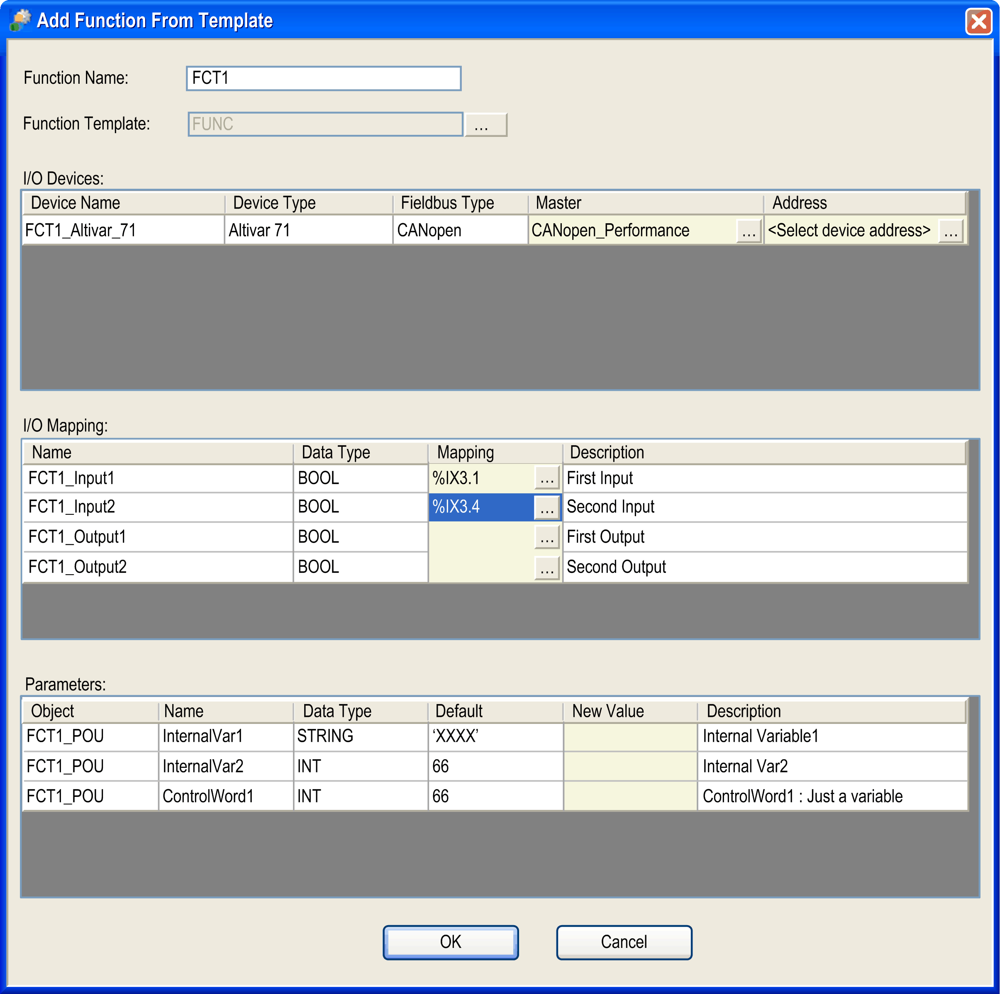
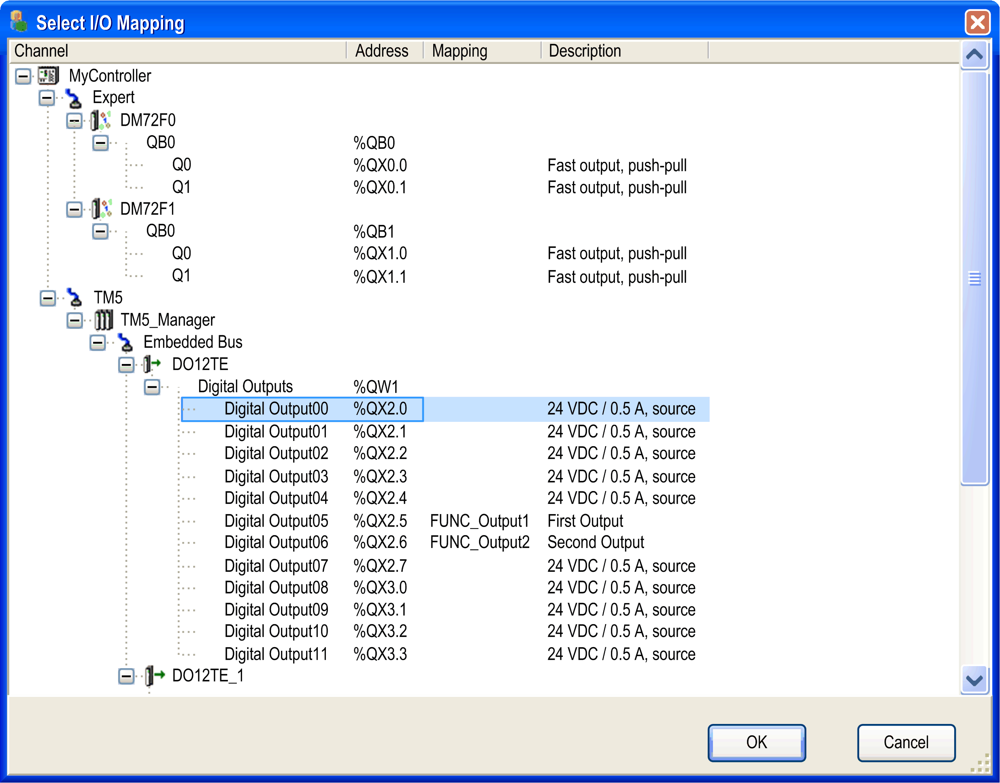

# Adding Functions from Template

## Overview

You can add an application function from a function template by right-clicking a suitable node in a navigator and executing the command Add Function From Template from the contextual menu.

Suitable nodes are:

* An application node in the Applications tree
* A folder node below an application node in the Applications tree
* A controller node in the Functional tree
* A functional module node in the Functional tree

As a result, the Add Function From Template dialog box opens.

## Add Function From Template Dialog Box

The Add Function From Template dialog box provides the following elements to configure your function:

| Element | | Description |
| --- | --- | --- |
| Function Name text box | | Enter a name that is used for the new folder of this application and for the naming of the elements it contains. |
| Function Template | | Click the ... button and select a function template from the Select Function Template dialog box. |
| I/O Devices table | | – |
|  | Device Name | Contains the name of the future field device. You cannot change this name. |
|  | Device Type | Indicates the type of the field device. You cannot edit this cell. |
|  | Fieldbus Type | Indicates the fieldbus type of the field device. You cannot edit this cell. |
|  | Master | Contains the fieldbus master to which the field device is connected. If there are several masters, you can select the master of your choice from the list. |
|  | Address | Initially empty. For field devices on fieldbusses that require numerical addresses (Modbus serial line and CANopen), click the ... button right to the field and assign the address of your choice. |
| I/O Mapping table | | Lists the I/O variables that are part of the function template. It allows you to map them to the I/O channels of existing devices and modules. |
|  | Name | Contains the name of the I/O variable that has to be mapped on an I/O channel. |
|  | Data Type | Indicates the data type of the I/O channel to which the I/O variable was originally mapped. |
|  | Mapping | Click the ... button to open the Select I/O Mapping dialog box. It allows you to select an I/O channel on which you can map the selected variable.  After the variable has been mapped to an I/O channel, this Mapping field contains the input or output address of the I/O channel on which the variable is mapped. |
|  | Description | Contains a description of the I/O variable. |
| Parameters table | | Lists the template parameters included in the function template. |
|  | Object | Indicates the name of the GVL or program in which the variable is defined. You cannot edit this field. |
|  | Name | Contains the name of the variable. You cannot edit this cell. |
|  | Data Type | Indicates the data type of the variable. You cannot edit this cell. |
|  | Default | Indicates the default value of the variable. This is the initial value of the variable when the template was created. You cannot edit this cell. |
|  | New Value | Edit this cell if you want to assign a new value to the variable. If you leave this cell empty, the Default value is used for this variable.  Enter a value that is valid for the given data type. |
|  | Description | Contains a description of the variable. |
| OK button | | Confirm your settings by clicking the OK button.  **Result**: The settings are verified for correctness and the new application function is inserted as separate node below the Application node or an error detection message is displayed. |

## Select I/O Mapping Dialog Box

The Select I/O Mapping dialog box is used to map a variable selected in the Add Function From Template dialog box to an I/O channel.

It displays the available I/O channels in a tree structure, similar to the Devices tree. The root node is the controller. Only those I/O channels are displayed whose data type fits to the data type of the new variable.

Two data types are compatible if they have identical type names or if they are elementary IEC data types of the same size.

Example:

UINT --> INT allowed

UDINT --> INT not allowed

Display the subnodes by clicking the plus signs.

The Select I/O Mapping dialog box contains the following columns:

| Column | Description |
| --- | --- |
| Channel | Contains the tree structure. Each device is represented by the device name and the device icon. Each I/O channel is represented by the channel name. |
| Address | Contains the input / output address that corresponds to the I/O channel. |
| Mapping | Contains the I/O variable that is currently mapped on the I/O channel. |
| Description | Contains the description of the I/O channel. |

Consider the following practices for mapping variables to I/O channels:

* Map all variables provided by the function template to I/O channels.
* You can map an I/O variable of a function template to an I/O channel that already has a mapping. The existing mapping is overwritten.
* Any mappings that lead to multiple assignments of variables on the same I/O channel are not allowed.

## Objects Created

The function template creates the following objects in your project:

| Object | Description |
| --- | --- |
| Root folder | A new folder is created under the Application node in the Devices tree that is named as defined in the Function Name text box. |
| Field devices | The field devices that are included in the function template are created using names that apply to the naming rules and are connected to the fieldbus master. The I/O mapping is automatically adjusted, if necessary. |
| Objects available as subnodes of the root folder in the navigators | The objects that are included in the function template are created below the root folder in the respective navigator (Devices tree, Applications tree, Tools tree) using names that apply to the naming rules. The properties of the objects are automatically adjusted. |
| Task configuration | The task configuration is adjusted as required by the function template. |
| Global variable lists | The global variable lists that are included in the function template are created below the root folder using names that apply to the naming rules. |
| External variables | Global variables whose global variable lists do not belong to the function template are restored in their original global variable list as follows:   * If a global variable list with the original name does not already exist below the application, it is created automatically. * If a global variable with the original name does not already exist in this global variable list, it is created automatically.   If the type of global variable is incorrect, an error detection message is displayed. |
| Persistent variables | Persistent variables are restored in the respective variable list of the application as follows:   * If a persistent variable list does not already exist below the application, it is created automatically with its original name. * If a variable with the original name does not already exist in the persistent variable list, it is created automatically.   If the type of persistent variable is incorrect, an error detection message is displayed. |
| External objects | Objects that are not included in the function template but are referenced by the function template (such as function blocks and DUTs) are handled as follows:   * If the object does not exist, it is created * If the object already exists and has not been modified, it remains unchanged * If the object already exists and modifications are detected, an error is reported in the Messages view. To display further information on the detected modifications, click the entry in the Messages view. |

Any objects that are created with the instantiation of the function template are listed in the Messages pane.

## Naming of Objects

In order to avoid naming conflicts, if you instantiate the same function template several times on the same controller device, the following naming conventions are applied to the application functions and the associated objects:

| If the name of the original object... | Then ... |
| --- | --- |
| **Case 1**: | |
| contains the name of the application function, | this part of the object is replaced by the name of the new application function that is created. |
| **Example**: | |
| The template original application function `Axis` contains a program `Axis_Init`. | For a new application function `Axis1` being created with this template, the new program is correspondingly named `Axis1_Init`. |
| **Case 2**: | |
| does not contain the name of the application function, | the name of the new application function plus an underscore are inserted in the original name to form a unique new name. |
| **Example**: | |
| The original application function `Axis` contains a program `InitProg`. | For a new application function `Axis1` being created with this function template, the new program is correspondingly named `Axis1_InitProg`. |

NOTE: Use rather short names for your application functions so that they are completely displayed.

EIO0000002854.09