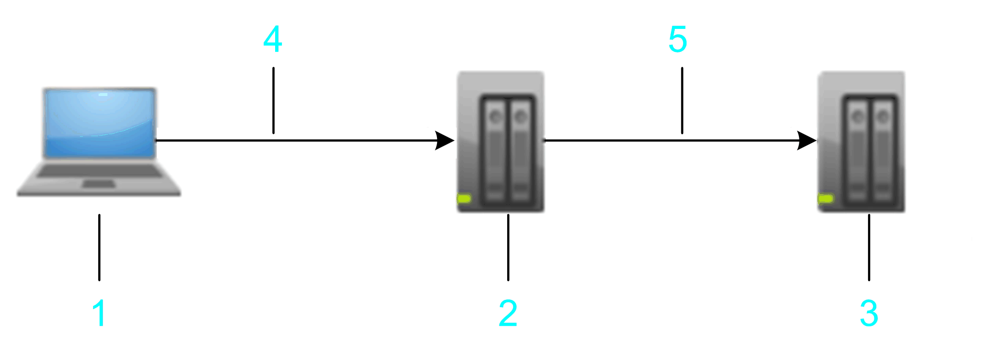
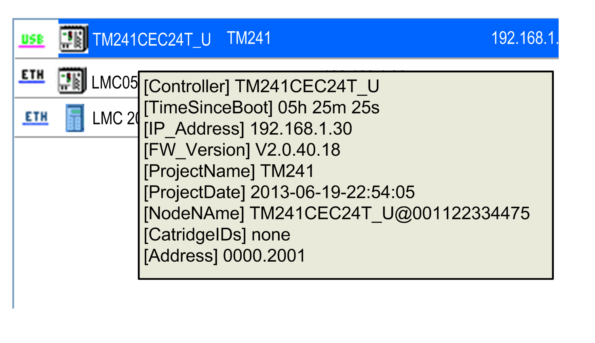

# Connecting via IP Address and Address Information

## Overview

The used communication protocol offers a mechanism to connect to a controller independent of the type of connection. For example, this allows access to a target controller that is connected via Ethernet to another hop controller that is connected via USB to the PC itself.

**1** PC

**2** hop controller

**3** target controller

**4** USB

**5** Ethernet

## Address Information

In the example, USB uses a different protocol. It is therefore normally not possible to use the IP address to address the target controller. Instead, the routing information is used that describes the way to connect to the target controller over 1 or more hops.

This routing information is displayed as a tooltip of an entry of the controller list (in the following example [Address] 0000.2001):

NOTE: Since this address only describes the way the controller is connected, it can change upon each modification of the local PCs or the network adapter settings of the hop controller. For example, upon activating or deactivating network adapters or upon starting/stopping services that use network adapters. The address to a specific target can differ from different sending PCs.

## Nodename

Since the Nodename of the controller is a stable identifier in the system, it is used to identify the target.

If IP Address is selected as Connection Mode, it is tried to get the information from the Nodename itself. Some controllers (such as LMC •0•C) create the Nodename automatically including the IP address. You can also configure the Nodename by yourself (as described in the [FAQ Why is the Controller not Listed in the Communication Settings View?](D-SE-0083819.html#D-SE-0083819__D-SE-0083819.5)) to enable the system to find a controller by its IP address. If the IP address is missing in the nodename, it is tried to get the IP address from a controller. But not all devices or their current firmware version support the service. In this case, use the Connection Mode Nodename to connect or set a device name that includes the IP address in brackets. For example MyDevice (192.168.1.30).

EIO0000002854.09