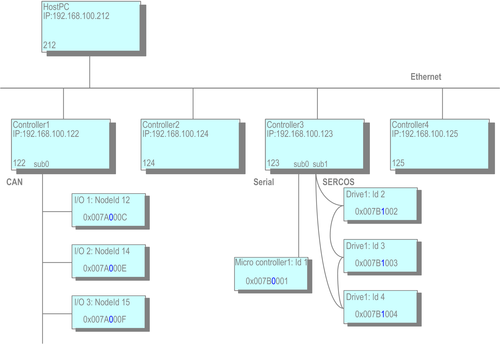

# Addressing and Routing

## Overview

Addressing maps the topology of the control network to unique addresses. A [node address](D-SE-0083825.html#D-SE-0083825__D-SE-0083825.5) is built up hierarchically.

For each network connection, a local address identifying the node uniquely within its respective local network is allocated by the relevant block driver. For the entire node address, this local address is preceded by the subnet index the local network is assigned to by the parent. Furthermore, it must be preceded by the node address of its parent.

The length of the subnet index (in bit) is determined by the device, whereas the length of the local address is determined by the network type.

A node without a main network is a top-level node with address 0. A node with a main network that does not contain a parent is also a top-level node and will be assigned to its local address in the main network.

Example: Main net and sub nets

In the example, the addresses of the child nodes are given in hexadecimal representation. The first 4 digits represent the address of the particular parent within the main net. For example, 0x007A=122 for PLC1. The next byte (displayed in blue) is reserved for the subnet index and this is followed by the local address, for example, C=12 for node ID 12.

Due to the structuring of the address, the routing algorithm can be kept relatively lean. For example, no routing tables are necessary. Information is required locally: on the own address and on the address of the parent node.

Thereon, a node may properly handle data packets.

* If the target address equals the address of the current node, it is determined as receiver.
* If the target address starts with the address of the current node, the packet is intended for a child or descendant of the node and has to be forwarded.
* Else, the receiver is not a descendant of the current node. The packet has to be forwarded to the own parent.

## Relative Addressing

Relative addressing is a special feature. [Relative addresses](D-SE-0083825.html#D-SE-0083825__D-SE-0083825.6) do not contain the node number of the receiver node, but directly describe the path from the sender to the receiver. The principle is similar to a relative path in the file system: The address consists of the number of steps the packet has to move up, that is, to the next respective parent, and the subsequent path down to the target node.

The advantage of relative addressing is that 2 nodes within the same subtree are able to continue the communication when the entire subtree is moved to another position within the overall control network. While the absolute node addresses will change due to such a relocation, the relative addresses are still valid.

## Determination of Addresses

A node attempts to determine its own address as that coming from its parent or whether itself is a top-level node. For this purpose, a node will send an address determination via a broadcast message to its main network during boot-up. As long as this message is not responded to, the node considers itself to be a top-level node, although it will continue to try to detect a parent node. A parent node will respond by an address notification. Thereon, the node will complete its own address and pass it to the subnets.

Address determination can be executed at bootup or on request of the programming PC.

EIO0000002854.09