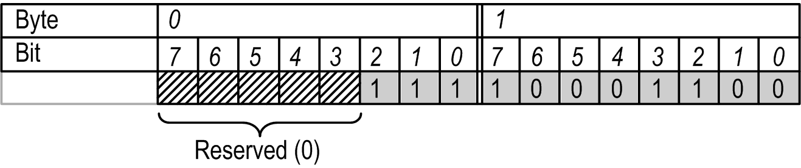
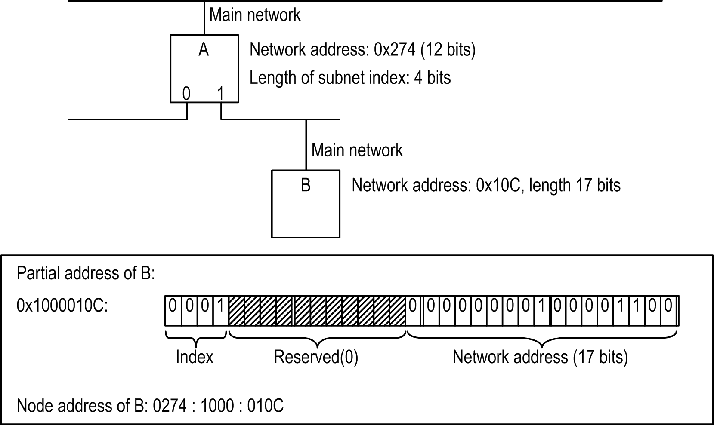

# Structure of Addresses

## Overview

Below is a detailed description on the structure of the following address types:

* [Network Addresses](#D-SE-0083825__D-SE-0083825.3)
* [Node Addresses](#D-SE-0083825__D-SE-0083825.5)
* [Absolute and Relative Addresses](#D-SE-0083825__D-SE-0083825.6)
* [Broadcast Addresses](#D-SE-0083825__D-SE-0083825.8)

## Network Addresses

Network addresses represent a mapping of addresses of a network type (for example, IP addresses) to logical addresses within a control network. This mapping is handled by the respective block driver. Within an Ethernet with class C IP addresses, the first 3 bytes of the IP address are the same for all network devices. Therefore, the last 8 bits of the IP address suffice as a network address since they allow unambiguous mapping between the 2 addresses at the block driver.

A node has separate network addresses for each network connection. Different network connections may have the same network address since this address has to be unique only locally for each network connection.

Terminology: In general, the network address of a node without a statement of the network connection refers to the network address in the main network.

The length of a network address is specified in bits and can be chosen by the block driver as required. Within a network segment, the same length must be used for all nodes.

A network address is represented as an array of bytes with the following coding:

* Length of the network address: n bits
* Required bytes: b = (n + 7) DIV 8
* The (n MOD 8) lowest-order bits of the first byte and all remaining (n DIV 8) bytes are used for the network address.

## Example - Network Address

Length: 11 bit

Address: 111 1000 1100

Example for network address coding

## Node Addresses

The node address indicates the absolute address of a node within a control network, and therefore, is unique within the whole tree. The address consists of up to 15 address components, each consisting of 2 bytes. The lower a node is located within the network hierarchy, the longer its address.

The node address consists of the partial addresses of all predecessors of the node and the node itself. Each partial address consists of one or several address components. The length is therefore always a multiple of 2. The partial address of a node is formed from the network address of the node in its main network and the subnet index of the main network in the parent node. The bits required for the subnet index are determined by the router of the parent node. Filler bits are inserted between the subnet index and the network address in order to ensure that the length of the partial address is a multiple of 2 bytes.

Special cases:

* Node has no main network: There is no subnet index nor a network address in the main network. In this case, the address is set to 0x0000.
* Node with main network but without parent: In this case, a subnet index with 0-bit length is assumed. The partial address corresponds to the network address, supplemented by filler bits if required.

Example - node address

The node address representation is always hexadecimal. The individual address components (2 bytes in each case) are separated by a colon (:). The bytes within a component display sequentially without a separator (see example above). Since this represents a byte array and not a 16-bit value, the components are not displayed in little-endian format. For manually entered addresses missing digits in an address component are filled with leading zeros from the left: 274 = 0274. To improve readability, the output should always include the leading zeros.

## Absolute and Relative Addresses

Communication between 2 nodes can be based on relative or absolute addresses. Absolute addresses are identical to node addresses. Relative addresses specify a path from the sender to the receiver. They consist of an address offset and a descending path to the receiver.

The (negative) address offset describes the number of address components that a packet has to be handed upwards in the tree before it can be handed down again from a common parent. Since nodes can use partial addresses consisting of more than one address component, the number of parent nodes to be passed is always = the address offset. Therefore, the demarcation between parent nodes is no longer unambiguous. This is why the common initial part of the addresses of the communication partners is used as parent address. Each address component is counted as an upward step, irrespective of the actual parent nodes. Any error introduced by these assumptions can be detected by the respective parent node and must be handled correctly by the node.

On arrival at the common parent, the relative path (an array of address components) is then followed downwards in the normal way.

Formal: The node address of the receiver is formed by removing the last address offset components from the node address of the sender and appending the relative path to the remaining address.

## Example

Within the example, a letter will represent an address component, whereas a point will separate the particular nodes. Since a node is allowed to have multiple address components, it is allowed to have multiple letters within the example.

Node A: a.bc.d.ef.g

Node B: a.bc.i.j.kl.m

* Address of the lowest common parent: a.bc
* Relative address from A to B: -4/i.j.kl.m (The number -4 results from the 4 components d, e, f, and g. Therefore the packet has to be raised).

The relative address has to be adjusted with each pass through an intermediate node. It is sufficient to adjust the address offset. This is always done by the parent node: If a node receives a packet from one of its subnets, the address offset is increased by the length of the address component of this subnet.

* If the new address offset is < 0, the packet must be forwarded to the parent node.
* If the address offset 1 ≥ 0, the packet must be forwarded to the child node of the local address of which is located at the position described by the address offset within the relative address. First, the address offset must be increased by the length of the local address of the child node to ensure that the node sees a correct address.

A special situation arises when the error described above occurs while determining the common parent. In this case, the address offset at the “real” common parent is negative, but the magnitude is greater than the length of the partial address of the subnet the packet originates from. The node must detect this case, calculate the local address of the next child node based on the address of the previous node and the length difference, and adapt the address offset such that the next node will see a correct relative address. Also, the address components themselves remain unchanged and only the address offset will be modified.

## Broadcast Addresses

There are 2 types of broadcasts - global and local ones. A global broadcast is sent to all nodes within a control network. The empty node address (length 0) is reserved for this purpose.

Local broadcasts are sent to all devices of a network segment. For this purpose, all bits of the network address are set to 1. This is possible both in relative and in absolute addresses.

A block driver must be able to handle both broadcast addresses, that is, empty network addresses and network addresses with all bits set to 1, must be interpreted and sent as broadcast.

EIO0000002854.09