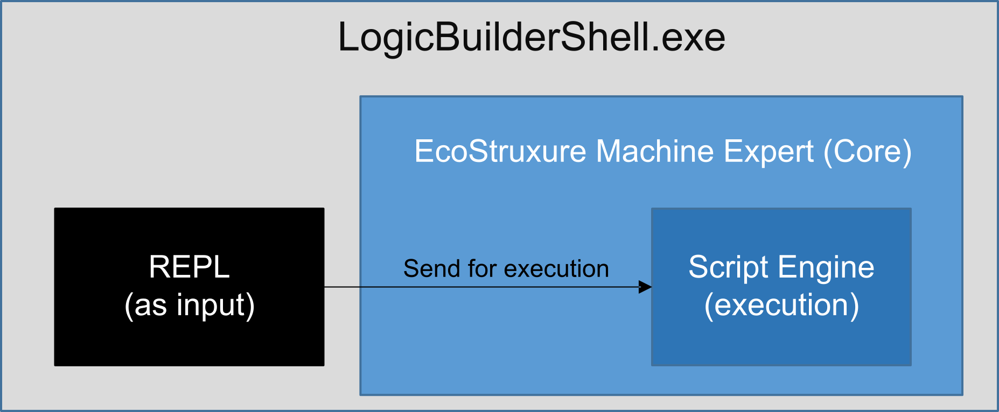
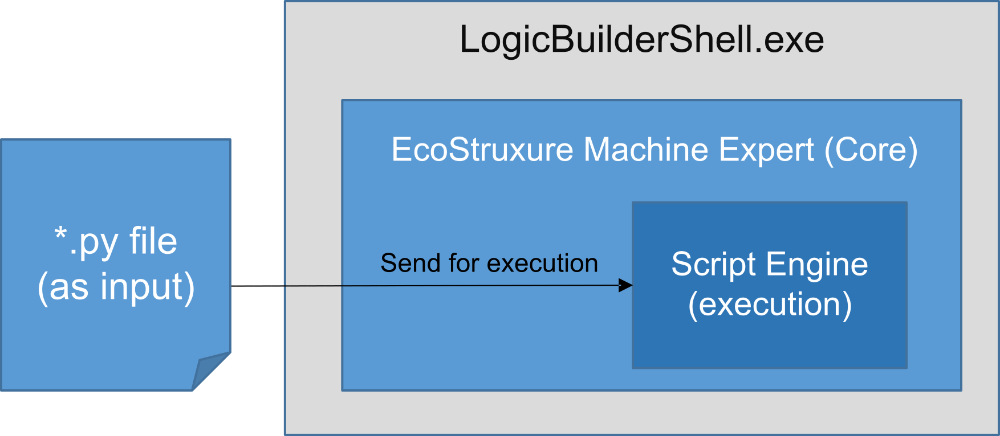

# Accessing the Python Interpreter

## Overview

EcoStruxure Machine Expert can be automated with the Python script language.

The Python scripting capabilities are exposed in various ways. The table lists different entry points:

| Where | Input type | Description / Use case | How to open |
| --- | --- | --- | --- |
| Logic Builder user interface | Interactive (REPL) | Interactive Python shell with a command-line interface, embedded in the user interface | Menu command View > Scripting > Scripting Immediate in the Logic Builder (also refer to the chapter [*Using the* Logic Builder *Scripting Immediate View*](D-SE-0083836.html#D-SE-0083836__D-SE-0083836.3)). |
| Python file (\*.py) | Select a script file to be executed from within the user interface. | Menu command Tools > Scripting > Execute Script File... command in the Logic Builder (also refer to the chapter [*Using the* Logic Builder *Scripting Immediate View*](D-SE-0083836.html#D-SE-0083836). |
| Stand-alone shell | REPL | Interactive Python shell with a command-line interface, running stand-alone (without the graphical user interface). | Open LogicBuilderShell.exe without command-line arguments (refer to the chapter [*Using the Logic Builder Shell*](D-SE-0083835.html#D-SE-0083835)). |
| Python file (\*.py) | Executes a Python script from the Windows command-line, from a batch file, or similar ways. | Open LogicBuilderShell.exe with a script file as a command-line argument (refer to the chapter [*Using the Logic Builder Shell*](D-SE-0083835.html#D-SE-0083835)). |

The following sections provide an overview of how Python scripting integrates in EcoStruxure Machine Expert for different use cases.

## Logic Builder User Interface

The Logic Builder user interface allows you to execute script files via the Tools > Scripting > Execute Script File... command or executes scripting statements via the Scripting Immediate view

The Scripting Immediate view is a (Python) interpreter integrated in EcoStruxure Machine Expert allowing you, for example, to start functions.

The Scripting Immediate view hosts an interpreter and is based on REPL principles.

The block diagram shows how the user interface is using the script engine to execute Python commands:

## Execute Statements Via Interactive Shell

The block diagram shows how the interactive interpreter in a REPL-based shell is using the script engine to execute Python statements:

## Script Execution Via Non-Interactive Shell

The block diagram shows how the (non-interactive) shell is using the script engine to execute scripts:

EIO0000002854.09