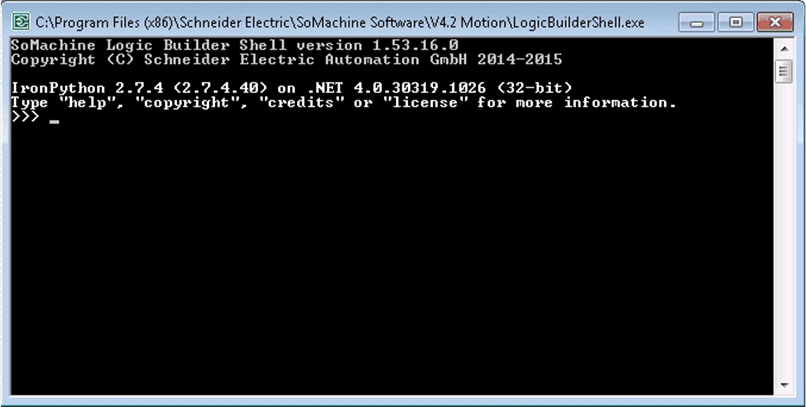

# Using the Logic Builder Shell

## Starting the Logic Builder Shell

The LogicBuilderShell.exe is located in the installation directory of EcoStruxure Machine Expert.

The Logic Builder Shell provides a REPL that is based on the IronPython ipy.exe. This is the REPL of the standard IronPython package when installed on a PC. Hence, it provides the same functionalities, such as tab completion, Python script debugging support, and so on. Plus in addition, it allows access to the EcoStruxure Machine Expert Python API.

Double-click the LogicBuilderShell.exe to start the Logic Builder Shell (without arguments) in a console.

**Result**: The input prompt (`>>>`) is displayed:



## Commands

At the input prompt (`>>>`), type your Python statements and press Enter to execute them.

The following sequence of commands provides an example on how to open a project, search a device node and print the name:

```
IronPython 2.7.4 (2.7.4.40) on .NET 4.0.30319.18444 (32-bit)
Type "help", "copyright", "credits" or "license" for more information.
>>> projectName = "C:\\temp\\MyProject.project"
>>> proj = projects.open(projectName)
>>> sercosNode = proj.find("SERCOSIII", True)[0]
>>> print(sercosNode.get_name(False))
SERCOSIII
>>>
```

Usage:

```
LogicBuilderShell.exe [options] [file.py|- [arguments]]
```

The `[options]` are defined in the list of command-line arguments below.

`[arguments]` is a placeholder for arguments that are passed to the script file.

Command-line arguments of the Logic Builder Shell:

| Command-line argument | Description | Example |
| --- | --- | --- |
| ``` -h / --help ``` | Prints the IronPython command-line help. | ``` LogicBuilderShell.exe --help LogicBuilderShell.exe -h ``` |
| ``` -m <module> ``` | Run library module as script. | ``` LogicBuilderShell.exe -m pdb MyScript.py ``` |
| ``` -i ``` | Inspect interactively after running script. | ``` LogicBuilderShell.exe -i MyScript.py ``` |
| ``` <Script File> ``` | Runs the specified Python script file. | ``` LogicBuilderShell.exe MyScript.py ``` |
| ``` --nologo ``` | Skips the display of the informational text of the Logic Builder during startup.  Skips the display of the `…terminated` message during shutdown. | ``` LogicBuilderShell.exe --nologo ``` |

You can combine different command-line arguments. For example, the `-i` argument can be combined with a specified Python script file and `-nologo`.

The list shows only a selection of IronPython command-line arguments. For a complete list, refer to the IronPython website and documentation.

## Use Cases for the Logic Builder Shell

You can use the Logic Builder Shell in different scenarios. The following use cases show how it helps to improve the usability of working with EcoStruxure Machine Expert and the Python scripting language.

## Use Case 1

When executing scripts in Continuous Integration (CI) systems - for example, to Checkout an EcoStruxure Machine Expert project from Subversion (SVN), compile the project and save as library - you need the script output printed to a console. With the LogicBuilderShell.exe as real console application, you can redirect the output or call it in a CI system (for example, Jenkins) where the output is fetched and added to a build log.

Example:

```
LogicBuilderShell.exe MyScript.py > output.txt
```

## Use Case 2

LogicBuilderShell.exe allows you to use the built-in command-line debugging feature called `pdb` module.

Example:

```
LogicBuilderShell.exe -m pdb MyScript.py
```

## Use Case 3

Test your Python scripts in no UI mode to verify that it is working. In console mode, you can enter input via the console. Keep in mind that reading input from the console is only possible in the LogicBuilderShell.exe. In the Scripting Immediate view, that is available in the user interface, no console input is possible. This has the effect that the statement `readline()` is ignored.

Example:

```
import sys
print("Please enter a text: ")
text = sys.stdin.readline()
print("Your entered text: " + text)
```

## Use Case 4

Explore the Python and EcoStruxure Machine Expert API and documentation.

* Use the built-in `help()` feature to access the Python help via the IronPython shell. To achieve this, make sure that an Internet connection is available.

Example:

```
help()      # start the built-in help module
topics      # list all available topics
##### here you'll get the list of available topics #####
LIST        # dumps the help to work with lists.
##### here you'll get the help working with lists #####
quit        # leaf build-in help feature
```

* Use the built-in `dir()` feature to print available api functions.

Example:

```
dir()       # prints the list of defined variables and functions in current script scope
##### here you'll get the list of defined variables or functions in current script scope #####
import sys
dir(sys)    # prints the available functions defined in sys module
##### here you'll get the list of defined variables or functions in sys module #####
```

* Use the `inspectapi` module to explore the EcoStruxure Machine Expert Python API. Due do technical restrictions, the built-in `dir()` feature of Python cannot print the API help for the EcoStruxure Machine Expert Python API. To achieve this, use the `inspectapi`.

Example:

```
inspectapi.dir(projects)  # prints the available API functions of "projects" which provides access e.g. to open a project
##### here you'll get the Machine Expert API provided via "projects" variable #####
```

## Use Case 5

Use `-i` switch as argument passed to the LogicBuilderShell.exe in combination with a specified script to get the shell prompt at the end of the script run. This can help to inspect interactively after running a script, for example, to see the content of variables.

## Benefits of the Logic Builder Shell

It is a best practice to use the LogicBuilderShell.exe to execute scripts instead of using LogicBuilder.exe to run scripts in no UI mode. Both ways are still possible but the command line of the LogicBuilderShell.exe provides a better usability and the Logic Builder Shell prints the output to the console.

Example of using the LogicBuilder.exe to run scripts in no UI mode:

```
LogicBuilder.exe -noui --runscript="<script file>"
```

Example of using the LogicBuilderShell.exe:

```
LogicBuilderShell.exe "<script file>"
```

## Debugging Python Scripts with Command-Line Debugger Module `pdb`

The LogicBuilderShell.exe provides the built-in command line debugging feature `pdb` module (for more documentation, refer to <https://docs.python.org/2/library/pdb.html>). This is a feature for experts and used to debug Python scripts or to find an issue. IronPython itself provides a module that can be loaded into a shell. When you start your own script via the `pdb` function `run(…)`, you can debug the Python code in the console. The console application only provides text-based UI possibilities.

The module `pdb` defines an interactive source code debugger for Python programs. It provides the following features:

* Setting (conditional) breakpoints and single stepping at the source line level
* Inspection of stack frames
* Source code listing
* Evaluation of arbitrary Python code in the context of any stack frame

To start a Python script directly in `pdb`, use the following command-line syntax:

```
LogicBuilderShell.exe -m pdb MyScript.py
```

Selection of `pdb` debugger commands (refer to the Python help on the Internet for more details):

| Debugger command | Command description |
| --- | --- |
| ``` h(elp) [command] ``` | Without argument, print the list of available commands.  With a command as argument, print help about that command.  `help pdb` displays the documentation file. |
| ``` r(un) ``` | Restart the debugged Python program. |
| ``` b(reak) ``` | With a line number argument, set a break at this position in the file.  With a function argument, set a break at the first executable statement within that function. The line number may be prefixed with a file name and a colon to specify a breakpoint in another file (probably one that has not been loaded yet). The file is searched on `sys.path`. Each breakpoint is assigned a number to which the other breakpoint commands refer.  If a second argument is present, it is an expression which must evaluate to TRUE before the breakpoint is honored.  Without argument, list all breaks. For each breakpoint listed, the number of times that the breakpoint has been hit, the ignore count, and the associated condition, if any, are included. |
| ``` l(ist) [first[, last]] ``` | List source code for the file.  Without arguments, list 11 lines around the current line or continue the previous listing.  With one argument, list 11 lines around at that line.  With two arguments, list the given range; if the second argument is less than the first, it is interpreted as a count. |
| ``` c(ontinue) ``` | Continue execution, only stop when a breakpoint is encountered. |
| ``` n(ext) ``` | Continue execution until the next line in the current function is reached or it returns. (The difference between `next` and `step` is that `step` stops inside a called function while `next` executes called functions at (nearly) full speed, only stopping at the next line in the current function.) |
| ``` s(tep) ``` | Execute the current line, stop at the first possible occasion (either in a function that is called or on the next line in the current function). |
| ``` u(ntil) ``` | Continue execution until the line with the line number greater than the current one is reached or when returning from the current frame. |
| ``` r(eturn) ``` | Continue execution until the current function returns. |
| ``` w(here) ``` | Print a stack trace, with the most recent frame at the bottom. An arrow indicates the current frame, which determines the context of most commands. |
| ``` q(uit) ``` | Quit from the debugger. The program being executed is aborted. |

## Debugging Example with `pdb`

Example Python script to be debugged:

```
print("Demonstration how to use Python pdb module to debug Python scripts")
```

```
# close open project
if projects.primary:
    print("Close project")
    projects.primary.close()
```

```
print("Open project")
projects.open("c:\\Temp\\MyProject.project")
```

```
sercosDevice = projects.primary.find("SERCOSIII", True)[0]
```

```
sercosDeviceName = sercosDevice.get_name(False)
```

```
print("Sercos device name: " + sercosDeviceName)
```

```
print("Close project")
projects.primary.close()
```

In each line in the following listing starting with `(pdb)`, a debugger command is executed, such as `list (l)` or `help` or `next (n)` or `quit (q)`. In between you can see the statement or its output which was executed.

```
LogicBuilderShell.exe -m pdb PythonDemonstration.py
Logic Builder Shell version 1.53.16.0
Copyright (C) Schneider Electric Automation GmbH 2014-2015
```

```
Demonstration how to use Python pdb module to debug Python scripts
> C:\temp\Pythondemonstration.py(5)<module>()
-> if projects.primary:
(Pdb) help
```

```
Documented commands (type help <topic>):
========================================
EOF    bt         cont      enable  jump  pp       run      unt
a      c          continue  exit    l     q        s        until
alias  cl         d         h       list  quit     step     up
args   clear      debug     help    n     r        tbreak   w
b      commands   disable   ignore  next  restart  u        whatis
break  condition  down      j       p     return   unalias  where
```

```
Miscellaneous help topics:
==========================
exec  pdb
```

```
Undocumented commands:
======================
retval  rv
(Pdb) l
  1
  2     print("Demonstration how to use Python pdb module to debug Python scripts")
  3
  4     # close open project
  5  -> if projects.primary:
  6         print("Close project")
  7         projects.primary.close()
  8
  9     print("Open project")
 10     projects.open("c:\\Temp\\MyProject.project")
 11
(Pdb) n
> C:\temp\Pythondemonstration.py(9)<module>()
-> print("Open project")
(Pdb) n
Open project
> C:\temp\Pythondemonstration.py(10)<module>()
-> projects.open("c:\\Temp\\MyProject.project")
(Pdb) l
  5     if projects.primary:
  6         print("Close project")
  7         projects.primary.close()
  8
  9     print("Open project")
 10  -> projects.open("c:\\Temp\\MyProject.project")
 11
 12     sercosDevice = projects.primary.find("SERCOSIII", True)[0]
 13
 14     sercosDeviceName = sercosDevice.get_name(False)
 15
(Pdb) n
IOError: IOError(...oject'.")
> C:\temp\Pythondemonstration.py(10)<module>()
-> projects.open("c:\\Temp\\MyProject.project")
(Pdb) q
Logic Builder Shell terminated.
```

EIO0000002854.09