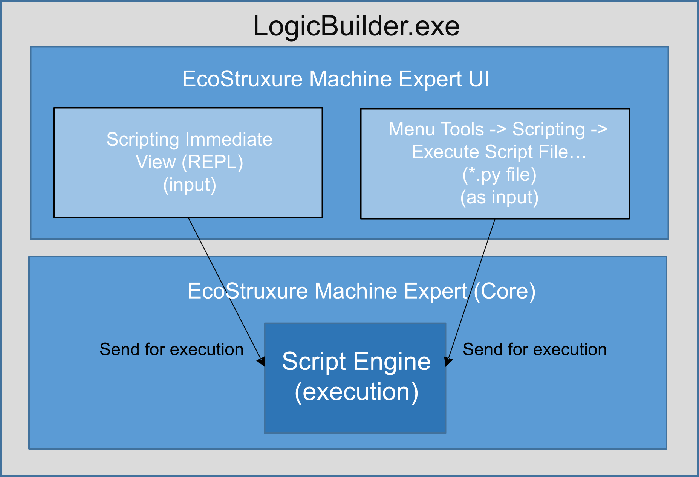
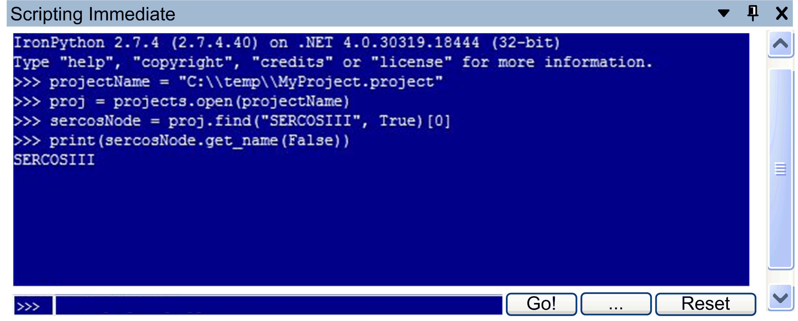
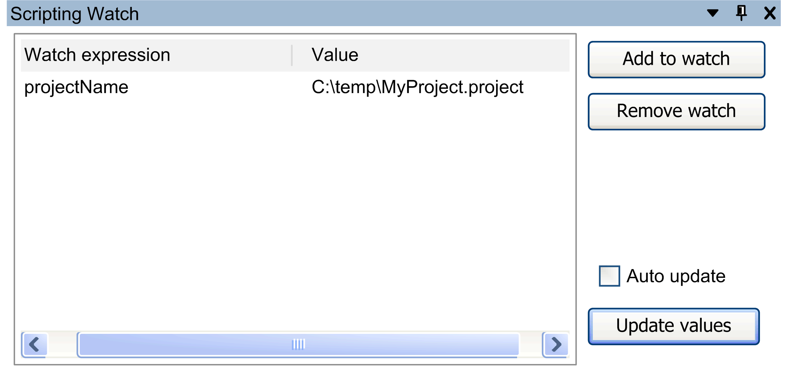

# Using the Logic Builder Scripting Immediate View

## Overview

When you start the Logic Builder with user interface via LogicBuilder.exe, then the following two commands are available to open two views dedicated to scripting purposes:

* View > Scripting > Scripting Immediate
* View > Scripting > Scripting Watch

Script execution in the EcoStruxure Machine Expert user interface via the Execute Script File... command or via the Scripting Immediate view:



## Scripting Immediate View

The Scripting Immediate view is a host for the same REPL as you can use in the Logic Builder Shell. It allows you to interact with EcoStruxure Machine Expert in a textual based interface in parallel to the user interface.

Execute the command View > Scripting > Scripting Immediate to open the Scripting Immediate view.

The figure provides an example of how to open a project, find a device object and print its name in the Scripting Immediate view.



The Scripting Immediate view allows you to enter Python statements and to execute them (using the REPL).

To run a Python script file, click the ... button or enter the script name into the prompt textbox and click the Go! button.


Click the Reset button to reset the Scripting Immediate view and to clear the current scope.

## Scripting Watch View

The Scripting Watch view shows the content of the Python variables you have defined.

Execute the command View > Scripting > Scripting Watch to open the Scripting Watch view.



Elements of the Scripting Watch view:

| Element | Description |
| --- | --- |
| Add to watch button | To add a watch expression, type the expression into the Scripting Immediate view prompt, and click the Add to watch button. |
| Remove watch button | To remove a watch expression, select an entry in the Scripting Watch view, and click the Remove watch button. |
| Auto update option | Select the Auto update option to enable the auto update function for expressions in the Scripting Watch view.  NOTE: The process of refreshing values can lead to additional PC CPU load. |
| Update values button | The Scripting Watch view list is updated automatically each time a statement is executed in the Scripting Immediate view. To update the list manually, click the Update values button. |

## Example

Enter and execute the following statement in the Scripting Immediate view.

```
projectName = "C:\\temp\\MyProject.project"
```

Proceed as follows:

| Step | Action |
| --- | --- |
| 1 | Enter `projectName` in the Scripting Immediate view. |
| 2 | Click the Add to watch button in the Scripting Watch view.  **Result**: The variable `projectName` is displayed in the Scripting Watch list. |

When you assign a different value to the variable `projectName`, the changed content is displayed.

EIO0000002854.09