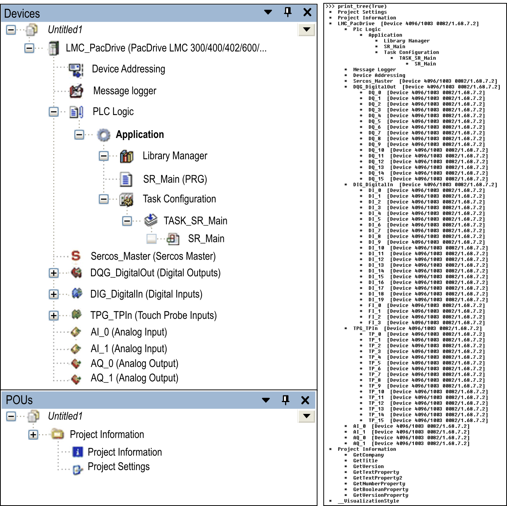

# EcoStruxure Machine Expert Scripting - Python API

## Overview

EcoStruxure Machine Expert provides a Python API that you can use in Python scripts.

The Python API consists of two categories:

* Standard Python API and Python modules / packages
* EcoStruxure Machine Expert Python API

The standard Python API (for dealing with strings, arrays, files, and so on) is part of the installation. For detailed help, consult the Internet (for example, [https://docs.python.org/3/](https://docs.python.org/3)). You can extend your installation by Python modules and packages available on the Internet.

To automate EcoStruxure Machine Expert, an EcoStruxure Machine Expert Python API is also included in the installation. It is used, for example, to open or close a project, to change the project content or to compile a project and download it to a controller.

The EcoStruxure Machine Expert Python API concept is described in this chapter. Also refer to the [script engine examples](D-SE-0083848.html#D-SE-0083848). To explore the EcoStruxure Machine Expert Python API, refer to the chapter [Explore Python API](D-SE-0083838.html#D-SE-0083838).

For details of method / function descriptions or their parameter descriptions, refer to the section [*Scripting Engine*](../../../../../api/crossBook?lang=en-US&virtualBookName=SE_ScriptEngine&topicID=idx_scriptingengine).

## Python API Concept Based on Object-Oriented Programming

To find the API methods suitable to your Python scripts, you must become familiar with the EcoStruxure Machine Expert Python API concept and how the API is integrated into the script engine (script execution). The main concept behind the EcoStruxure Machine Expert Python API is an object-oriented API approach. Object-oriented programming (OOP) is a programming paradigm based on two concepts: objects and code. Objects are data structures that contain data, in the form of fields, also called attributes. Code is available in the form of procedures, also called methods. The procedures of an object can access and modify the data fields of the object with which they are associated. Computer programs that are designed according to OOP consist of objects that interact with one another.

The challenge while writing scripts is to map the detailed EcoStruxure Machine Expert Python API documentation on the right objects to call the procedures.

## Predefined Variables and Types

When you run a script or use the REPL (in LogicBuilderShell.exe or Scripting Immediate view,) you have a main script scope with predefined variables (and types). You can use them in your script as an entry to the EcoStruxure Machine Expert Python API. To list the available predefined variables in the main script scope, start the LogicBuilderShell.exe and execute `dir()`.

List of predefined variables by running `dir()`:

```
>>> dir()
['AccessRight', 'ApplicationState', 'ArchiveCategories', 'ChannelType', 'Compile
rMessage', 'ConflictResolve', 'ConnectorRole', 'CredentialSourceKind', 'DeviceID
', 'DeviceUserManagementFlags', 'DiagType', 'ExportReporter', 'Guid', 'Implement
ationLanguage', 'ImportReporter', 'MultipleChoiceSelector', 'NativeExportReporte
r', 'NativeImportFilter', 'NativeImportHandler', 'NativeImportResolve', 'NativeI
mportResult', 'ObjectPermissionKind', 'OnlineChangeOption', 'OperatingState', 'P
ermissionState', 'ProjectType', 'PromptChoice', 'PromptChoiceFilter', 'PromptHan
dling', 'PromptResult', 'ResetOption', 'SV_DEV', 'SV_POU', 'Severity', 'TimeoutE
xception', 'ValuesFailedException', 'Version', '__builtins__',
'__doc__', '__file__', '__name__', 'communication_settings', 'compiler_settings'
, 'etest_test_provider', 'feature_settings_manager', 'librarymanager', 'libraryp
ackage_service', 'new_project', 'online', 'projects', 'system', 'visualization_s
ettings']
```

The predefined entries from this list written in lower case letters are variables which reference to an object that provides methods or fields. This is a kind of global API that works with or without a loaded project.

For example, `system`, or `projects` or `online`.

* `system`: Functionality for integrating EcoStruxure Machine Expert. This object provides the functions that are documented in `ISystemInterface`, such as accessing the Messages view from EcoStruxure Machine Expert, or using ui\_present to verify whether the program is running in `--noUI` mode.
* `projects`: Functionality for project management. This object provides the functions that are documented in `IScriptProjects Interface`, such as loading projects and project archives. Furthermore, this is the entry point to individual projects.
* `online`: Functionality for online access to the controller. You can use the `create_online_application` method to retrieve a specific online object (documented in `IScriptOnlineApplication`) for an application object. This object allows you to log in to a controller, start the application, and read variable values.

For more information, refer to the *Script Engine Plugin API Reference* part of the online help.

The predefined entries from this list starting with an upper case letter are enumerations or types/classes which can be used or instantiated in your Python script. For example, `DeviceID` (class) or `Guid` (class) or `PromptChoice` (enumeration).

## Searching and Navigating Within the Tree Structure

A project consists of devices, POUs, DUTs, GVLs, and so on, which are organized in a tree of objects (see, for example, the Devices tree in the Logic Builder). This tree of objects (the project tree) is attached to `projects.primary`. In `projects.primary`, the API allows you to search objects by using the `find(…)` method. You can navigate within the project tree, for example, by using the `get_children()` method to get the immediate child objects (for example, the controller devices). On each child object, you can call `get_children()` again to get their immediate child objects, and so on.

NOTE: The methods available on the project tree objects can vary from object to object depending on its type (POU, DUT, GVL, device). It is a best practice to use `inspectapi.dir(…)` to see the list of available API methods on an object.

## Examples

Example of using a global API function to open a project :

```
projects.open("MyProject.project")
```

Example of using a global API function to open a file-based storage project (\*.fbs):

```
projects.open("MyProject.fbs")
```

Example to find and rename a project tree object (after a project was loaded):

```
myObject = projects.primary.find("SERCOSIII")[0]
myObject.rename("New_SERCOSIII_Name")
```

The figure shows the project tree object in the user interface and the traversed project tree printed by a script:



Example script to traverse the project tree (as printed above):

```
def print_tree_of_obj(treeobj, depth=0, verbose=False):
    name = treeobj.get_name(False)   
    if treeobj.is_device:
        deviceid = treeobj.get_device_identification()
        details = ""
        if verbose == True:
            details = " [Device {0}/{1}/{2}]".format(deviceid.type, deviceid.id, deviceid.version)
        print("{0} * {1}{2}".format("   "*depth, name, details))
    else:
        print("{0} * {1}".format("   "*depth, name))
   
    for child in treeobj.get_children(False):
        print_tree_of_obj(child, depth+1, verbose)
```

```
def print_tree_of_project(pro, verbose=False):
    if pro == None:
        print("No project open.")
    else:
        for obj in pro.get_children():
            print_tree_of_obj(obj, 0, verbose)
```

```
def print_tree(verbose=False):
    if projects.primary != None:
        print_tree_of_project(projects.primary, verbose)
    else:
        print("No project open.")
```

```
print_tree(True)
```

EIO0000002854.09