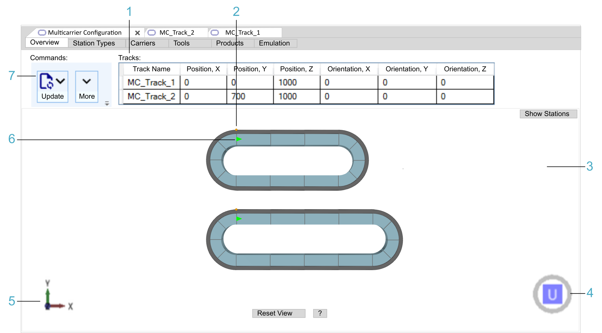

# Overview Tab (Exclusive to Multi-track Mode)

## Overview

The Overview tab is only displayed when more than one track is available in the project.

| Legend item | Description | Refer to |
| --- | --- | --- |
| 1 | The Tracks table provides information on the positions of the different tracks in space (in a cartesian coordinate system). | [Tracks](#OverviewTab-E4C6B98A__Tracks-E4CD141B) |
| 2 | The orange dots indicate the reference points for the coordinate values provided in the Tracks table. | [Tracks](#OverviewTab-E4C6B98A__Tracks-E4CD141B) |
| 3 | The View area displays the tracks with their components in a simplified 3-D graphical representation. | [View](TPC_MLS-Config_Tab_Track-D99C4272.html#TPC_MLS-Config_Tab_Track-D99C4272__View-DA21CAC8) |
| 4 | The cube with U, D, B, F, R, or L is used for selecting a pre-defined view of the View area. | [View](TPC_MLS-Config_Tab_Track-D99C4272.html#TPC_MLS-Config_Tab_Track-D99C4272__View-DA21CAC8) |
| 5 | The 3-D coordinate system icon represents the global 3-D coordinate system of the View area. | [View](TPC_MLS-Config_Tab_Track-D99C4272.html#TPC_MLS-Config_Tab_Track-D99C4272__View-DA21CAC8) |
| 6 | The green arrows indicate the first segments per track in working direction. | [Topological Direction versus Working Direction](TPC_MLS-Config_Tab_Track-D99C4272.html#TPC_MLS-Config_Tab_Track-D99C4272__PhysicalTopologicalDirectionVersusW-54389AA4) |
| 7 | The Commands area provides buttons to perform the following tasks:   * Synchronizing the Multicarrier Configuration editor with the code and the devices in your project. * Importing / exporting a system configuration. | [Commands](#OverviewTab-E4C6B98A__Commands-E4CCEDB9) |

## Commands

| Command | Description |
| --- | --- |
| Update | For a detailed description of the update options to adapt the devices in the Devices tree or the multi carrier objects in the Applications tree to the content of the Multicarrier Configuration editor and vice versa, refer to [Update Commands](UpdateCmds-E87521AA.html). |
| More | Provides commands for exporting and importing a system configuration:  * Export System Configuration...  Execute this command to export a system configuration file (XML). * Import System Configuration...  Execute this command to import a system configuration file (XML). |

## Tracks

The Tracks table lists the tracks available in your project by indicating the Position and Orientation in X, Y and Z direction of the global coordinate system.

| Value | Description |
| --- | --- |
| Track Name | Displays the name of the track (not editable). |
| Position | By default, the position of a track is 0, 0, 1000.  NOTE: The offset of 1000 in Z direction is by default inserted to help ensure that the track is visible in the emulation and not obscured by the workspace floor. |
| Orientation | The values define a rotation of the track around a base point indicated by the orange dot that represents the origin of the local coordinate system of the track.  The orientation is defined according to the intrinsic convention with the default orientation convention ZYX. In an intrinsic system, each of the elemental rotations is performed on the coordinate system as rotated by the previous operation(s). For further information, refer to *Information About the Coordinate System* in the EcoStruxure Machine Expert Twin Getting Started User Guide.  Value range: -180...180° |

EIO0000004647.03