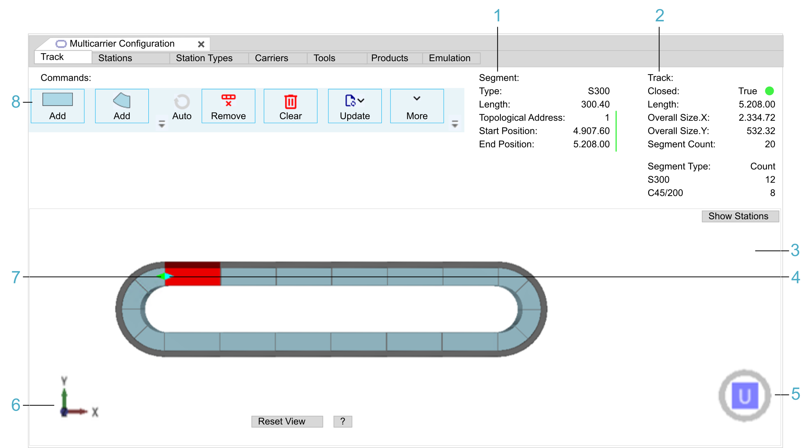

# Track Tab

## Overview

The Track tab allows you to create a track out of segments.

This is a track-specific tab. In multi-track mode, it is displayed under the track editor.

The following figure displays a Track tab as part of the Multicarrier Configuration editor in single-track mode. In projects with multiple tracks, a specific track editor is provided per track.

| Legend item | Description | Refer to |
| --- | --- | --- |
| 1 | The Segment information provides information on the segment selected in the View area. | [Segment Information](#TPC_MLS-Config_Tab_Track-D99C4272__SegmentInformation-D9A922B2) |
| 2 | The Track information provides information on the track. | [Track Information](#TPC_MLS-Config_Tab_Track-D99C4272__TrackInformation-DA1E89A8) |
| 3 | The View area displays the track with its components in a simplified 3-D graphical representation. | [View](#TPC_MLS-Config_Tab_Track-D99C4272__View-DA21CAC8) |
| 4 | The light blue arrow indicates the first segment of the track in topological direction. | [Topological Direction versus Working Direction](#TPC_MLS-Config_Tab_Track-D99C4272__PhysicalTopologicalDirectionVersusW-54389AA4) |
| 5 | The cube with U, D, B, F, R, or L is used for selecting a pre-defined view of the track. | [View](#TPC_MLS-Config_Tab_Track-D99C4272__View-DA21CAC8) |
| 6 | The 3-D coordinate system icon represents the 3-D coordinate system of the track. | [View](#TPC_MLS-Config_Tab_Track-D99C4272__View-DA21CAC8) |
| 7 | The green arrow indicates the first segment in working direction. | [Topological Direction versus Working Direction](#TPC_MLS-Config_Tab_Track-D99C4272__PhysicalTopologicalDirectionVersusW-54389AA4) |
| 8 | The Commands area provides buttons to perform the following tasks:   * Adding / removing straight and curved segments to / from the track. * Completing the track automatically. * Synchronizing the Multicarrier Configuration editor with the application and the devices in your project. * Importing / exporting track configurations. | [Commands](#TPC_MLS-Config_Tab_Track-D99C4272__Commands-D9A0DF97) |

## Topological Direction versus Working Direction

As a basis for understanding the following explanations, note the general information on the topological and the working direction within the track:

* **Topological direction**

  The topological direction reflects the Sercos topology of the segments.

  A light blue arrow marks the first segment (see legend item 4 in the [figure](#TPC_MLS-Config_Tab_Track-D99C4272__TrackTab-F1AACA07)).

  The topological addresses are assigned in the physical direction. Use the [command Topological Start Address](#TPC_MLS-Config_Tab_Track-D99C4272__TopologicalStartAddress-F1A964ED) to configure addresses.
* **Working direction**

  The default working direction is the same as the topological direction (not inverted). For further information on the working direction, refer to the [Multicarrier Library Guide](../../../../../api/crossBook?lang=en-US&virtualBookName=MLSLib&topicID=IntroMC_CoordSys_0FC9FA31).

  A green arrow marks the first segment in working direction (see legend item 7 in the [figure](#TPC_MLS-Config_Tab_Track-D99C4272__TrackTab-F1AACA07)). The positions of carriers, tools and products are calculated relative to the first segment in working direction.

**NOTE:** In case of default working direction (the direction is not inverted), the light blue arrow is not visible as the green and blue arrows both point in the same direction. The green arrow is displayed on top.

## Commands

| Command | Description |
| --- | --- |
| Add (straight / arc segment) | Adds the number of segments configured with the Count field after the selected segment in the [topological direction](#TPC_MLS-Config_Tab_Track-D99C4272__PhysicalTopologicalDirectionVersusW-54389AA4).  By default, the first segment you add is interpreted as the topological start of your track.  The topological start of your track is represented by a light blue arrow. |
| Auto | Completes the track automatically. This button becomes active as soon as the track can be closed by a point symmetric copy of the already configured track. |
| Remove | Removes the segment selected in the View area. You can also select multiple segments by holding the Ctrl key while selecting the segments. |
| Clear | Removes all segments. |
| Update | In multi-track mode, the Update button is displayed under the Overview tab because the update commands are track-independent.  For a detailed description of the update options to adapt the devices in the Devices tree or the multi carrier objects in the Applications tree to the content of the Multicarrier Configuration editor and vice versa, refer to [Update Commands](UpdateCmds-E87521AA.html). |
| More | Provides commands for export / import and the possibility to display the track options:  * Export Track...  Execute this command to export a track configuration file (XML). * Export System Configuration...  Execute this command to export a system configuration file (XML). * Import Track...  Execute this command to import a track configuration file (XML). * Import System Configuration...  Execute this command to import a system configuration file (XML). * Show Track Options  Displays the track options. |
| Direction: | Only displayed when the option Show Track Options is enabled from the list of More commands.   * Direction: > Not Inverted: The working direction is the same as the topological direction. * Direction: > Inverted: The working direction is opposite to the topological direction.   Also refer to [Topological Direction versus Working Direction](#TPC_MLS-Config_Tab_Track-D99C4272__PhysicalTopologicalDirectionVersusW-54389AA4). |
| Count: | Only displayed when the option Show Track Options is enabled from the list of More commands.  Enter the number of segments to be created in the Count field and click the Add button (straight / arc segment).  **Result**: The segments are displayed in the View area. |
| Topological Start Address: | Only displayed when the option Show Track Options is enabled from the list of More commands.  With the default value 1, the first segment you add is interpreted as the topological start of your track (also refer to the Add command in this table). Further segments are assigned addresses in increasing order.  To deactivate the automatic assignment of topological addresses to segments, set the Topological Start Address: parameter to the value -1.  For further information, refer to [Update > To Devices Command](UpdateCmds-E87521AA.html#UpdateCmds-E87521AA__UpdateToDevicesCommand-43B0D1CD). |

## Segment Information

| Information | Description |
| --- | --- |
| Type | Segment type. For example: S300 (straight, 300 mm), C45/200 (45° arc, 200 mm) |
| Length | Segment length. For example: 300.4 [mm], 200.4 [mm] |
| Topological Address | Topological address of the segment. The field is empty, if the Topological Start Address: is -1.  Also refer to [Topological Direction versus Working Direction](#TPC_MLS-Config_Tab_Track-D99C4272__PhysicalTopologicalDirectionVersusW-54389AA4). |
| Start Position | Start position of the segment [mm] in working direction.  Also refer to [Topological Direction versus Working Direction](#TPC_MLS-Config_Tab_Track-D99C4272__PhysicalTopologicalDirectionVersusW-54389AA4). |
| End Position | End position of the segment [mm] in working direction. |

## Track Information

| Information | Description |
| --- | --- |
| Closed | True = Closed track  False = Open track |
| Length | Track length. For example: 3405.60 [mm] |
| Overall Size, X | Overall size of the track in X direction |
| Overall Size, Y | Overall size of the track in Y direction |
| Segment Count | Total number of segments that constitute the track. |
| Segment Type Count | Number of straight and arc segments that constitute the track. |

## View

The View area displays the track with its components in a simplified 3-D graphical representation.

| Element | Description |
| --- | --- |
| 3-D coordinate system icon | Represents the 3-D coordinate system of the track (see legend item 6 in the [figure](#TPC_MLS-Config_Tab_Track-D99C4272__TrackTab-F1AACA07)). |
| Cube U, D, B, F, R, L | Serves to select a pre-defined view of the track (see legend item 5 in the [figure](#TPC_MLS-Config_Tab_Track-D99C4272__TrackTab-F1AACA07)).  If the view of the track is rotated, click one of the cube sides to display the track in a pre-defined view:   * U = Up view * D = Down view * B = Back view * F = Front view * R = Right view * L = Left view   Double-click a side of the cube to display the opposite view of the track. For example, double-clicking the U (Up view) displays the D (Down view).  You can also use the keyboard. Click Shift+Ctrl+U (D, B, F, R, L). |
| Show Stations | Toggles between displaying and not displaying the stations.  The track stations are created in the [Stations tab](TPC_MLS-Config_Tab_Stations-DA9DBC46.html). |
| Reset View | Displays the track in the Up view. The complete track is centered in the View area. |
| ? | Displays a help text for zooming, rotating, and moving the track in the View area. Click ? again to hide the help text. |

Zooming, rotating, and moving the track in the View area:

* Zooming:

  + Use the Page Up / Page Down keys of the keyboard.
  + Use the scroll wheel of the mouse.
  + Hold down the Ctrl key, hold down the right mouse button, and move the mouse.
* Rotating:

  + Use the arrow keys of the keyboard.
  + Hold down the right mouse button, and move the mouse.
* Moving:

  + Hold down the Shift key, and use the arrow keys of the keyboard.
  + Hold down the Shift key, hold down the right mouse button, and move the mouse.
  + Hold down the scroll wheel of the mouse, and move the mouse.

EIO0000004647.03