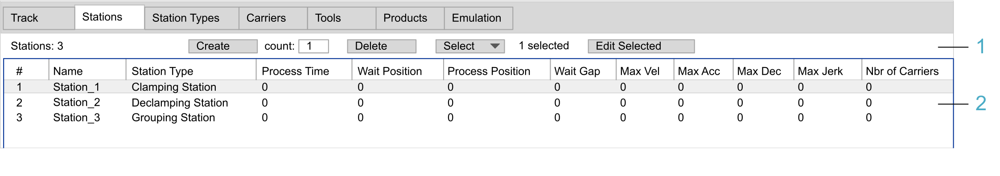

# Stations Tab

## Overview

The Stations tab allows you to create stations.

Stations are used to process products, such as loading, filling, labeling, unloading a product. For further information on stations, refer to the [MulticarrierStation Library Guide](../../../../../api/crossBook?lang=en-US&virtualBookName=MCRSLib&topicID=GeneralInfo_Lib_CDD74D3E).

This is a track-specific tab. In multi-track mode, it is displayed under the track editor.

The following figure displays a Stations tab as part of the Multicarrier Configuration editor in single-track mode.

| Legend item | Description | Refer to |
| --- | --- | --- |
| 1 | The header row provides elements for creating, deleting, selecting and editing stations. | [Header Row](#TPC_MLS-Config_Tab_Stations-DA9DBC46__HeadRow-DA9F36C2) |
| 2 | The table view allows you to display and configure the parameters of stations. | [Table View](#TPC_MLS-Config_Tab_Stations-DA9DBC46__TableView-DAA0712F) |

## Header Row

| Element | Description |
| --- | --- |
| Stations | Displays the total number of stations. |
| Create > count | Enter the number of stations to be created in the count field and click the Create button.  **Result**: The stations are displayed in the table view. |
| Delete button | Deletes the selected stations. |
| Select | You can select an option from the list for selecting station instances in the table view.   * All * Every Second * Every Third * Every Other Two * Invert Selection   NOTE: The number of stations selected is indicated.  As an alternative, you can select multiple station instances by holding down the Ctrl key while selecting the station instances in the table view.  **Result**: The station instances selected are marked in blue in the table view. |
| Edit Selected button | Opens a Property Editor to modify the properties of the station instance or instances selected in the table view. |

## Table View

The table view allows you to display and edit the properties of stations. Click in a table cell to edit it.

The parameters of this list are described in the MulticarrierStation Library Guide. For details, refer to [the MulticarrierStation Library Guide](../../../../../api/crossBook?lang=en-US&virtualBookName=MCRSLib&topicID=StandardStations_F040E185).

|  |  |
| --- | --- |
| Property | Description |
| # | Indicates the sequence number of the station. |
| Name | Enter a name for each station.  If you use the [Automatic updates feature](UpdateCmds-E87521AA.html#UpdateCmds-E87521AA__AutomaticUpdatesProjectSettings-4F9D86CB), the name must meet the following criteria:   * The name must be unique for each station, even if the stations are assigned to different tracks. If track 1, for example, includes a station called station\_1, then track 2 cannot include a station with the same name. * It must be a valid IEC identifier. * It must not contain leading and trailing underscore characters ‘\_’. |
| Station Type | Select from the list a station type you have configured in the [Station Types tab](StationTypeTab-F03E51E0.html). If no station type is selected, the station is a User Station. User Stations allow you to enter your own code.  NOTE: Add individual code only to User Stations. For further information, refer to the **For stations** paragraph of the [Update > To Code Command](UpdateCmds-E87521AA.html#UpdateCmds-E87521AA__UpdateToCodeCommand-43B0E772). |
| Process Time | Specify the process time (in ms) of the station. |
| Wait Position | Specify the waiting position (in mm) of the station.  NOTE: Usually, the waiting position is smaller than the process position. However, on a closed track, the process position can be smaller than the waiting position to extend the station beyond the start of the track. |
| Process Position | Specify the process position (in mm) of the station. |
| Wait Gap | Specify the waiting gap (in mm) of the station. |
| Max Vel | Specify the maximum velocity (in mm/s) of the carriers in the station. |
| Max Acc | Specify the maximum acceleration (in mm/s2) of the carriers in the station. |
| Max Dec | Specify the maximum deceleration (in mm/s2) of the carriers in the station. |
| Max Jerk | Specify the maximum jerk (in mm/s3) of the carriers in the station. |
| Nbr of Carriers | Specify the number of carriers that are to be processed inside the station at the same time. |

EIO0000004647.03