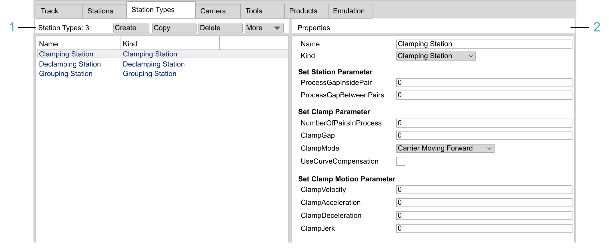

# Station Types Tab

## Overview

The Station Types tab allows you to create, copy, or delete station types that you can assign to the stations defined in the Stations tab.

Stations can be configured to perform specific functions. There are three kinds of standard stations. Each kind of station is supported by a dedicated function block of the MulticarrierStation library:

* Clamping for clamping a product by a pair of carriers
* Declamping for releasing the clamping of a product
* Grouping for combining carriers in groups

For further information, refer to the description of the Standard Stations in the [MulticarrierStation Library Guide](../../../../../api/crossBook?lang=en-US&virtualBookName=MCRSLib&topicID=StandardStations_F040E185).

Each kind of standard station comes with a specific set of properties. A station type is a definition of parameter values for a standard station. If a station type is assigned to a station, the station inherits the defined parameter values.



| Legend item | Description | Refer to |
| --- | --- | --- |
| 1 | List of Station Types and buttons to manage them. | [Managing Station Types](#StationTypeTab-F03E51E0__ManagingStationTypes-F0474B77) |
| 2 | Display and configure the parameters of the station type selected in the Station Types list. The parameters differ with the kind of station type selected from the Kind list. | [Station Types Properties](#StationTypeTab-F03E51E0__StationTypesProperties-F04631B1) |

## Managing Station Types

The left-hand side of the dialog box provides the list of Station Types and buttons to manage them.

| Element | Description |
| --- | --- |
| Station Types | Displays the total number of station types. |
| Create button | Creates a station type.  **Result**: The station type is added to the table with the default name Station Type <n>. |
| Copy button | Copies the station type selected in the table. |
| Delete button | Deletes the selected station type from the table. |
| More list | Provides commands for export / import:   * Export Selected...  Use this option to export a configuration file (XML) for the selected station type. * Export All...  Use this option to export a configuration file (XML) for all of the station types. * Import...  Use this option to import a station type configuration file (XML). |
| Name column | Name of the station type. |
| Kind column | Kind of station. |

## Station Types Properties

The Properties displayed on the right-hand side of the dialog box depend on the selected station kind.

Select the station kind from the list and configure the corresponding parameters as described in the MulticarrierStation Library Guide:

| Station Type | Parameters | Description in the MulticarrierStation Library Guide |
| --- | --- | --- |
| Clamping Station | Set Station Parameter   * ProcessGapInsidePair * ProcessGapBetweenPairs | [FB\_ClampingStation - SetStationParameter (Method)](../../../../../api/crossBook?lang=en-US&virtualBookName=MCRSLib&topicID=SetStationPara_EABCFF46) |
| Set Clamp Parameter   * NumberOfPairsInProcess * ClampGap * ClampMode * UseCurveCompensation | [FB\_ClampingStation - SetClampParameter (Method)](../../../../../api/crossBook?lang=en-US&virtualBookName=MCRSLib&topicID=SetClampPara_EB3FBFF7) |
| Set Clamp Motion Parameter   * ClampVelocity * ClampAcceleration * ClampDeceleration * ClampJerk | [FB\_ClampingStation - SetClampMotionParameter (Method)](../../../../../api/crossBook?lang=en-US&virtualBookName=MCRSLib&topicID=SetClampMotionPara_EAA2A709) |
| Declamping Station | Set Station Parameter  ProcessGap | [FB\_DeclampingStation - SetStationParameter (Method)](../../../../../api/crossBook?lang=en-US&virtualBookName=MCRSLib&topicID=SetStationPara_EABD5D80) |
| Set Declamp Parameter   * NumberOfPairsInProcess * DeclampGap * DeclampMode * UseCurveCompensation * MoveSyncWhenLeaveStation | [FB\_DeclampingStation - SetDeclampParameter (Method)](../../../../../api/crossBook?lang=en-US&virtualBookName=MCRSLib&topicID=SetDeclampPara_EB41579A) |
| Set Declamp Motion Parameter   * DeclampVelocity * DeclampAcceleration * DeclampDeceleration * DeclampJerk | [FB\_DeclampingStation - SetDeclampMotionParameter (Method)](../../../../../api/crossBook?lang=en-US&virtualBookName=MCRSLib&topicID=SetDeclaMotionPara_EAA23B5B) |
| Grouping Station | Grouping Pattern  Example:   ``` 50:10:10/50:60 ``` | [IF\_GroupingPattern](../../../../../api/crossBook?lang=en-US&virtualBookName=MCRSLib&topicID=IFGroupPattern_EEB73D60)  Groups are separated by '`/`'  Gaps are separated by '`:`' |
| Set Leaving Station Parameters   * NumberOfGroupsToSendToNextStation * KeepProcessGapWhenSendToNextStation * UseCurveCompensation * MoveSyncWhenLeaveStation | [FB\_GroupingStation - ChangeLeavingStationParameters (Method)](../../../../../api/crossBook?lang=en-US&virtualBookName=MCRSLib&topicID=ChangeLeavStat_EE52AABC) |

EIO0000004647.03