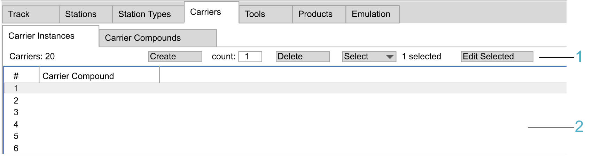
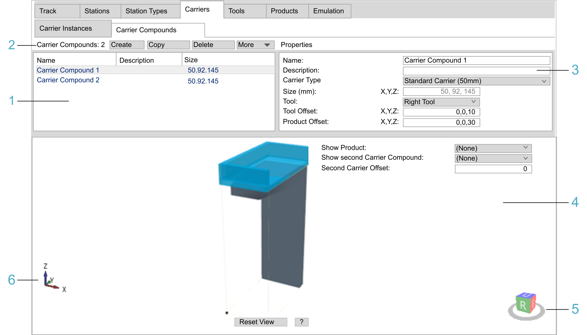

# Carriers Tab

## Overview

Carriers are used to transport the products on your track.

The Carriers tab provides the following sub-tabs:

* [Carrier Instances](#TPC_MLS-Config_Tab_Carriers-DAAA0843__CarrierInstancesSub-Tab-DAAAE3F6)

  + For creating, deleting, selecting, and editing carrier instances.
  + For displaying the properties of carrier instances, and for editing the properties.
  + A carrier instance can be assigned to a carrier compound.
* [Carrier Compounds](#TPC_MLS-Config_Tab_Carriers-DAAA0843__CarrierTypesSub-Tab-DAAF5A7C)

  + A carrier compound is a combination of a carrier type and a tool along with the tool offset and the offset of a product that can be handled with this carrier compound.
  + For creating, deleting, selecting, and editing carrier compounds.
  + For displaying the properties of created carrier compounds, and for editing the properties.

For the objects that are inserted for carriers in the Devices tree, refer to the [Update commands](UpdateCmds-E87521AA.html#UpdateCmds-E87521AA__UpdateToDevicesCommand-43B0D1CD).

## Carrier Instances Sub-Tab

| Legend item | Description | Refer to |
| --- | --- | --- |
| 1 | The header row provides elements for creating, deleting, selecting, and editing carrier instances. | [Header row](#TPC_MLS-Config_Tab_Carriers-DAAA0843__HeaderRow-79462BB5) |
| 2 | The table view allows you to display and edit the properties of carrier instances. | [Table view](#TPC_MLS-Config_Tab_Carriers-DAAA0843__TableView-79463775) |

Header row:

| Element | Description |
| --- | --- |
| Carriers | Displays the total number of carrier instances. |
| Create > count: | Enter the number of carriers to be created in the count: field and click the Create button.  **Result**: The carrier instances are displayed in the table view. |
| Delete button | Deletes the selected carrier instances. |
| Select | You can select an option from the list for selecting carrier instances in the table view.   * All * Every Second * Every Third * Every Other Two * Invert Selection   NOTE: The number of carriers selected is indicated.  As an alternative, you can select multiple carrier instances by holding down the Ctrl key while selecting the carrier instances in the table view.  **Result**: The carrier instances selected are marked in blue in the table view. |
| Edit Selected button | Opens a Property Editor to modify the properties of the carrier instances selected in the table view. |

Table view:

The table view displays the properties of the carrier instances:

| Property | Description |
| --- | --- |
| # | Sequence number of the carrier instance |
| Carrier Compound | Carrier compound the carrier instance is assigned to. |

Click in a table cell of column Carrier Compound to select a carrier compound created in the Carrier Compounds sub-tab.

## Carrier Compounds Sub-Tab

| Legend item | Description | Refer to |
| --- | --- | --- |
| 1 | The table view displays the main properties of carrier compounds. | [Table view](#TPC_MLS-Config_Tab_Carriers-DAAA0843__TableView-79487E5D) |
| 2 | The header row is used for creating, copying, deleting, importing, and exporting carrier compounds. | [Header row](#TPC_MLS-Config_Tab_Carriers-DAAA0843__HeaderRow-79487C10) |
| 3 | The Properties area is used for displaying and editing the properties of carrier compounds. | [Properties](#TPC_MLS-Config_Tab_Carriers-DAAA0843__Properties-79488811) |
| 4 | The View area displays the selected carrier compound with tools and products in a simplified 3-D graphical representation. | [View](#TPC_MLS-Config_Tab_Carriers-DAAA0843__View-79488BE0) |
| 5 | The cube with U, D, B, F, R, or L is used for selecting a pre-defined view of the carrier compound. | [View](#TPC_MLS-Config_Tab_Carriers-DAAA0843__View-79488BE0) |
| 6 | The 3-D coordinate system icon represents the 3-D coordinate system of the carrier compound. | [View](#TPC_MLS-Config_Tab_Carriers-DAAA0843__View-79488BE0) |

**Header row**:

| Element | Description |
| --- | --- |
| Carrier Compounds: | Displays the total number of carrier compounds. |
| Create button | Creates a carrier compound. The created carrier compounds are displayed in the table view. |
| Copy button | Copies the carrier compound selected in the table view. The suffix \_NN is appended to the name of the copied carrier compound. |
| Delete button | Deletes the carrier compound selected in the table view. |
| More | Provides commands for export / import:   * Export Selected...  Use this option to export a configuration file (XML) for the selected carrier compound. * Export All...  Use this option to export a configuration file (XML) for all of the carrier compounds. * Import...  Use this option to import a carrier compound configuration file (XML). |

**Table view**:

The table view displays the main properties of the carrier compounds:

| Property | Description |
| --- | --- |
| Name | Name of the carrier compound |
| Description | Description of the carrier compound |
| Size | Size of the carrier compound in X, Y, and Z direction |
| The properties can be modified in the [Properties part of the tab](#TPC_MLS-Config_Tab_Carriers-DAAA0843__Properties-79488811). | |

Click in a table cell to select a carrier compound created in the Carrier Compounds sub-tab.

Properties

The Properties part of the tab displays detailed properties of the selected carrier compound. You can edit the properties of the carrier compound.

| Property | Description |
| --- | --- |
| Name | Name of the carrier compound |
| Description | Description of the carrier compound |
| Carrier Type | Select a carrier type from the list of supported carrier types. |
| Size (mm) | Size of the carrier type in X, Y, and Z direction |
| Tool | Select a tool (from the list of tools created in the Tools tab) to be added to the carrier compound. |
| Tool Offset | Enter a value for the tool offset. |
| Product Offset | Enter a value for the offset of a product that can be handled by this carrier compound. |
| **Offset calculation**: The offset of a tool or of a product must be entered as the offset between the geometric center of the bounding box of the object and the center point of the carrier. The center point of the Lexium™ MC12 carrier (50 mm (1.97 in)) is located at the coordinates X = 25, Y = 60, Z = 145. It is displayed in the graphics as a small green sphere. | |

View

The View area displays the carrier with tools in a simplified 3-D graphical representation.

| Element | Description | |
| --- | --- | --- |
| 3-D coordinate system icon | Represents the 3-D coordinate system of the carrier compound (see legend item 6 in the [figure](#TPC_MLS-Config_Tab_Carriers-DAAA0843__CarrierComp-F1AB6637)). | |
| Cube U, D, B, F, R, L | Serves to select a pre-defined view of the carrier compound (see legend item 5 in the [figure](#TPC_MLS-Config_Tab_Carriers-DAAA0843__CarrierComp-F1AB6637)).  If the view of the carrier compound is rotated, click one of the cube sides to display the carrier compound in a pre-defined view:   * U = Up view * D = Down view * B = Back view * F = Front view * R = Right view * L = Left view   Double-click a side of the cube to display the opposite view of the carrier compound. For example, double-clicking the U (Up view) displays the D (Down view).  You can also use the keyboard. Click Shift+Ctrl+U (D, B, F, R, L). | |
| Show Product | Displays a product, if already created in the Products tab.  Select a product from the list. | Example: Carrier compound left and right with tools and product |
| Show Second Carrier Compound | Displays a second carrier compound, if already created in the Carrier Compounds sub-tab.  Select a carrier compound from the list.  NOTE: This feature can be useful when two carriers are used for clamping a product, i.e., the carriers are holding the product between them. |
| Second Carrier Offset | Enter a value for the offset of the second carrier in X direction. If the offset is positive, the second carrier is on the right, if it is negative, the second carrier is on the left. | |
| Reset View | Displays the carrier compound in the Up view. The whole carrier compound is centered in the View area. | |
| ? | Displays a help text for zooming, rotating, and moving the carrier compound in the View area. Click ? again to hide the help text. | |

Zooming, rotating, and moving the carrier compound in the View area:

* Zooming:

  + Use the Page Up / Page Down keys of the keyboard.
  + Use the scroll wheel of the mouse.
  + Hold down the Ctrl key, hold down the right mouse button, and move the mouse.
* Rotating:

  + Use the arrow keys of the keyboard.
  + Hold down the right mouse button, and move the mouse.
* Moving:

  + Hold down the Shift key, and use the arrow keys of the keyboard.
  + Hold down the Shift key, hold down the right mouse button, and move the mouse.
  + Hold down the scroll wheel of the mouse, and move the mouse.

EIO0000004647.03