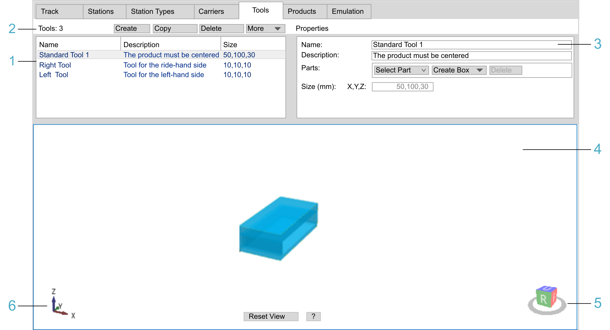

# Tools Tab

## Overview

The Tools tab allows you to create tool types. Tools are mounted on the carriers to hold the products during the transport.

| Legend item | Description | Refer to |
| --- | --- | --- |
| 1 | The table view displays the main properties of tool types. | [Table View](#TPC_MLS-Config_Tab_Tools-DCC4C529__TableView-DCC700F3) |
| 2 | The header row is used for creating, copying, deleting, importing, and exporting tool types. | [Header Row](#TPC_MLS-Config_Tab_Tools-DCC4C529__HeadRow-DCC639ED) |
| 3 | The Properties area is used for displaying and editing detailed properties of tool types. | [Properties](#TPC_MLS-Config_Tab_Tools-DCC4C529__Properties-DCC76E2F) |
| 4 | The View area displays the selected tool type in a simplified 3-D graphical representation. | [View](#TPC_MLS-Config_Tab_Tools-DCC4C529__View-DCC7D3A5) |
| 5 | The cube with U, D, B, F, R, or L is used for selecting a pre-defined view of the tool type. | [View](#TPC_MLS-Config_Tab_Tools-DCC4C529__View-DCC7D3A5) |
| 6 | The 3-D coordinate system icon represents the 3-D coordinate system of the tool type. | [View](#TPC_MLS-Config_Tab_Tools-DCC4C529__View-DCC7D3A5) |

## Header Row

| Element | Description |
| --- | --- |
| Tools: | Displays the total number of tools created. |
| Create button | Creates a tool type. The created tool types are displayed in the table view. |
| Copy button | Copies the tool type selected in the table view. The suffix \_NN is appended to the name of the copied tool type. |
| Delete button | Deletes the tools selected in the table view. |
| More | Provides commands for export / import:  * Export Selected...  Execute this command to export a configuration file (XML) for the selected tool type. * Export All...  Execute this command to export a configuration file (XML) for all of the tool types. * Import...  Execute this command to import a tool type configuration file (XML). |

## Table View

The table view displays the main properties of the tool types:

| Property | Description |
| --- | --- |
| Name | Name of the tool type |
| Description | Description of the tool type |
| Size | Size of the tool type in X, Y, and Z direction |
| The properties can be modified in the [Properties part of the tab](#TPC_MLS-Config_Tab_Tools-DCC4C529__PropertiesDetails-DCC7DBD6). | |

Click in a table cell to select a tool type created in the Tool tab.

## Properties

The Properties part of the tab displays detailed properties of the selected tool type. You can edit the properties and modify the shape of the tool type.

| Property | Description |
| --- | --- |
| Name | Name of the tool type |
| Description | Description of the tool type |
| Parts | Information on the parts that constitute the tool type  Select a part from the list to focus on it in the View area.  You can also create, copy, delete, and edit boxes and prisms to build a tool type.  Refer to the [Properties (Details)](#TPC_MLS-Config_Tab_Tools-DCC4C529__PropertiesDetails-DCC7DBD6) section. |
| Size (mm) | Calculated overall size of the tool type in X, Y, and Z direction |

## View

View

The View area displays the tool types in a simplified 3-D graphical representation.

| Element | Description | |
| --- | --- | --- |
| 3-D coordinate system icon | Represents the 3-D coordinate system of the tool type (see legend item 6 in the [figure](#TPC_MLS-Config_Tab_Tools-DCC4C529__ToolsTab-F1ABAEC3)). | |
| Cube U, D, B, F, R, L | Serves to select a pre-defined view of the tool type (see legend item 5 in the [figure](#TPC_MLS-Config_Tab_Tools-DCC4C529__ToolsTab-F1ABAEC3)).  If the view of the tool type is rotated, click one of the cube sides to display the tool type in a pre-defined view:   * U = Up view * D = Down view * B = Back view * F = Front view * R = Right view * L = Left view   Double-click a side of the cube to display the opposite view of the tool type. For example, double-clicking the U (Up view) displays the D (Down view).  You can also use the keyboard. Click Shift+Ctrl+U (D, B, F, R, L). | |
| Reset View | Displays the tool type in the Up view. The whole tool type is centered in the View area. | |
| ? | Displays a help text for zooming, rotating, and moving the tool type in the View area. Click ? again to hide the help text. | |

Zooming, rotating, and moving the track in the View area:

* Zooming:

  + Use the Page Up / Page Down keys of the keyboard.
  + Use the scroll wheel of the mouse.
  + Hold down the Ctrl key, hold down the right mouse button, and move the mouse.
* Rotating:

  + Use the arrow keys of the keyboard.
  + Hold down the right mouse button, and move the mouse.
* Moving:

  + Hold down the Shift key, and use the arrow keys of the keyboard.
  + Hold down the Shift key, hold down the right mouse button, and move the mouse.
  + Hold down the scroll wheel of the mouse, and move the mouse.

## Properties (Details)

You can build a tool type from boxes and prisms.

A box is defined by:

* Location: X,Y,Z
* Size: X,Y,Z

A prism is a body with the following properties:

* The upper and lower sides (called bases) are polygons in the X-Y plane with the same size and shape.
* The lateral sides are perpendicular.

A prism is defined by:

* Location: X,Y,Z

  The location defines the starting point of the lower side polygon.
* Height: Z

  The height is the distance between the upper and lower base.
* Points:

  The Points list displays the points of a polygon at the base of the prism.

  To add a point, click the + button, to remove a point from the polygon of the prism, click the - button.
* Point <n>: X, Y

  Displays the point of the polygon that is selected in the Points list. It displays Point 1 and greater as the starting point is defined by Location: X,Y,Z.

**Creating a left tool type (example):**

| Step | Action | Result / Comment |
| --- | --- | --- |
| 1 | Click the Create Box button. | A box is displayed in the View area. |
| 2 | Enter the following values: | Box 1:   * Location: 0,0,0 * Size: 50,100,5 |
| 3 | Create three boxes and enter the following values: | Box 2:   * Location: 0,5,5 * Size: 5,90,15  Box 3:   * Location: 0,0,5 * Size: 50,5,15  Box 4:   * Location: 0,95,5 * Size: 50,5,15 |

**Creating a right tool type:**

Create a right tool type in the same way: Repeat steps 1...3, but enter the following values for box 2:

Box 2:

* Location: 45,5,5
* Size: 5,90,15

EIO0000004647.03