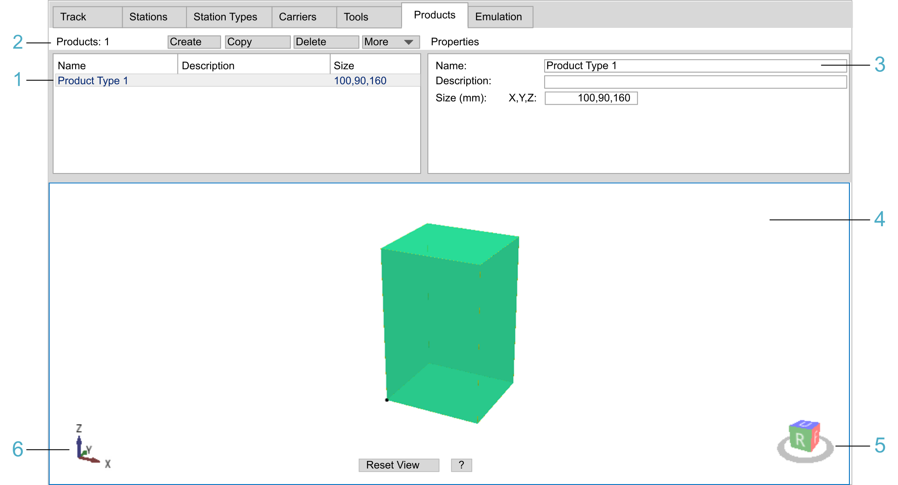

# Products Tab

## Overview

The Products tab allows you to create product types. The products are held by the tools on the carriers and are transported on the carriers on your track.

| Legend item | Description | Refer to |
| --- | --- | --- |
| 1 | The table view displays the main properties of product types. | [Table View](#TPC_MLS-Config_Tab_Products-DDB83FF9__TableView-DDBA6BD0) |
| 2 | The header row is used for creating, copying, deleting, importing, and exporting product types. | [Header Row](#TPC_MLS-Config_Tab_Products-DDB83FF9__HeadRow-DDB8F162) |
| 3 | The Properties area is used for displaying and editing detailed properties of product types. | [Properties](#TPC_MLS-Config_Tab_Products-DDB83FF9__Properties-DDBA849C) |
| 4 | The View area is used for displaying the selected product type in a simplified 3-D graphical representation. | [View](#TPC_MLS-Config_Tab_Products-DDB83FF9__View-DDBB214B) |
| 5 | The cube with U, D, B, F, R, or L is used for selecting a pre-defined view of the product type. | [View](#TPC_MLS-Config_Tab_Products-DDB83FF9__View-DDBB214B) |
| 6 | The 3-D coordinate system icon represents the 3-D coordinate system of the product type. | [View](#TPC_MLS-Config_Tab_Products-DDB83FF9__View-DDBB214B) |

## Header Row

| Element | Description |
| --- | --- |
| Products | Displays the total number of products. |
| Create button | Creates a product type. The created product types are displayed in the table view. |
| Copy button | Copies the product type selected in the table view. The suffix \_NN is appended to the name of the copied product type. |
| Delete button | Deletes the products selected in the table view. |
| More | Provides commands for export / import:  * Export Selected...  Execute this command to export a configuration file (XML) for the selected product type. * Export All...  Execute this command to export a configuration file (XML) for all of the product types. * Import...  Execute this command to import a product type configuration file (XML). |

## Table View

The table view displays the main properties of the product types:

| Property | Description |
| --- | --- |
| Name | Name of the product type |
| Description | Description of the product type |
| Size | Size of the product type in X, Y, and Z direction |
| The properties can be modified in the Properties part of the tab. | |

Click in a table cell to select a product type created in the Product tab.

## Properties

The Properties part of the tab displays detailed properties of the selected product type. You can edit the properties and modify the shape of the product type.

| Property | Description |
| --- | --- |
| Name | Name of the product type |
| Description | Description of the product type |
| Size (mm) | Size of the product type in X, Y, and Z direction  Refer to the section [Properties (Details)](#TPC_MLS-Config_Tab_Products-DDB83FF9__PropertiesDetails-DDBAA1C8). |

## View

View

The View area displays the product types in a simplified 3-D graphical representation.

| Element | Description | |
| --- | --- | --- |
| 3-D coordinate system icon | Represents the 3-D coordinate system of the product type (see legend item 6 in the [figure](#TPC_MLS-Config_Tab_Products-DDB83FF9__ProductsTab-F1ABD5E4)). | |
| Cube U, D, B, F, R, L | Serves to select a pre-defined view of the product type (see legend item 5 in the [figure](#TPC_MLS-Config_Tab_Products-DDB83FF9__ProductsTab-F1ABD5E4)).  If the view of the product type is rotated, click one of the cube sides to display the product type in a pre-defined view:   * U = Up view * D = Down view * B = Back view * F = Front view * R = Right view * L = Left view   Double-click a side of the cube to display the opposite view of the product type. For example, double-clicking the U (Up view) displays the D (Down view).  You can also use the keyboard. Click Shift+Ctrl+U (D, B, F, R, L). | |
| Reset View | Displays the product type in the Up view. The whole product type is centered in the View area. | |
| ? | Displays a help text for zooming, rotating, and moving the product type in the View area. Click ? again to hide the help text. | |

Zooming, rotating, and moving the carrier compound in the View area:

* Zooming:

  + Use the Page Up / Page Down keys of the keyboard.
  + Use the scroll wheel of the mouse.
  + Hold down the Ctrl key, hold down the right mouse button, and move the mouse.
* Rotating:

  + Use the arrow keys of the keyboard.
  + Hold down the right mouse button, and move the mouse.
* Moving:

  + Hold down the Shift key, and use the arrow keys of the keyboard.
  + Hold down the Shift key, hold down the right mouse button, and move the mouse.
  + Hold down the scroll wheel of the mouse, and move the mouse.

## Properties (Details)

You can create product types as boxes.

A box is defined by the Size (mm): X,Y,Z.

**Creating product types (example):**

| Step | Action | Result / Comment |
| --- | --- | --- |
| 1 | Click the Create button in the header row. | A box is displayed in the View area. |
| 2 | Enter the following values: | Box: Size: 100,90,160 |

EIO0000004647.03