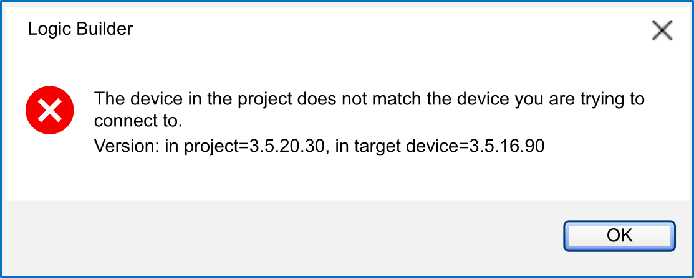

# Using a Device with an Earlier Firmware Version

## Overview

When logging in or downloading a project with a new version of EcoStruxure Machine Expert, you may encounter a compatibility concern with your controller firmware:

In this message, the Version: in project version is the device description version of the active application; the target device is the firmware version of the controller.

In this case, updating the device firmware is necessary. Device firmware is provided with the EcoStruxure Machine Expert installation (managed by the Schneider Electric Software Installer).

Refer to the [*Settings Helping to Preserve Compatibility*](D-SE-0088866.html#D-SE-0088866) to understand how to avoid this situation in future software versions.

Refer to the chapter [*Compatibility of Controller and Device Description Versions*](D-SE-0088869.html#D-SE-0088869) to understand the compatibility rules (which device version can be downloaded to which controller firmware version).

EIO0000002842.10