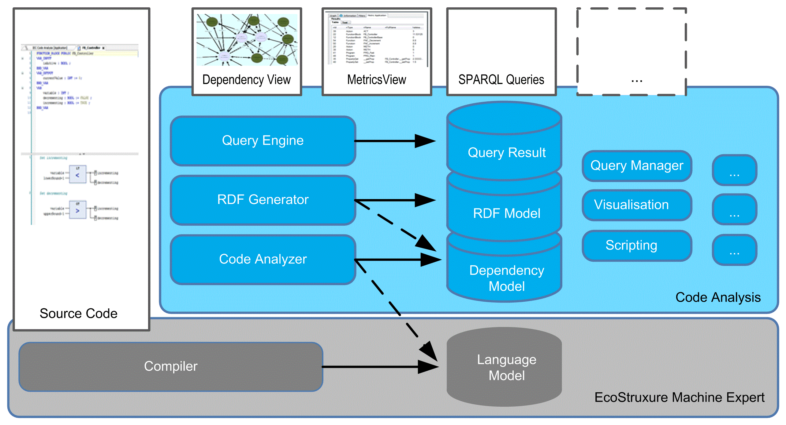
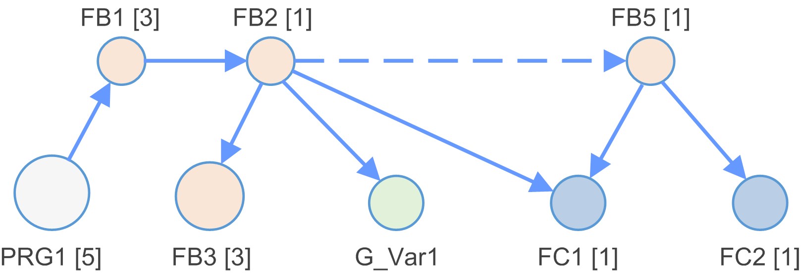
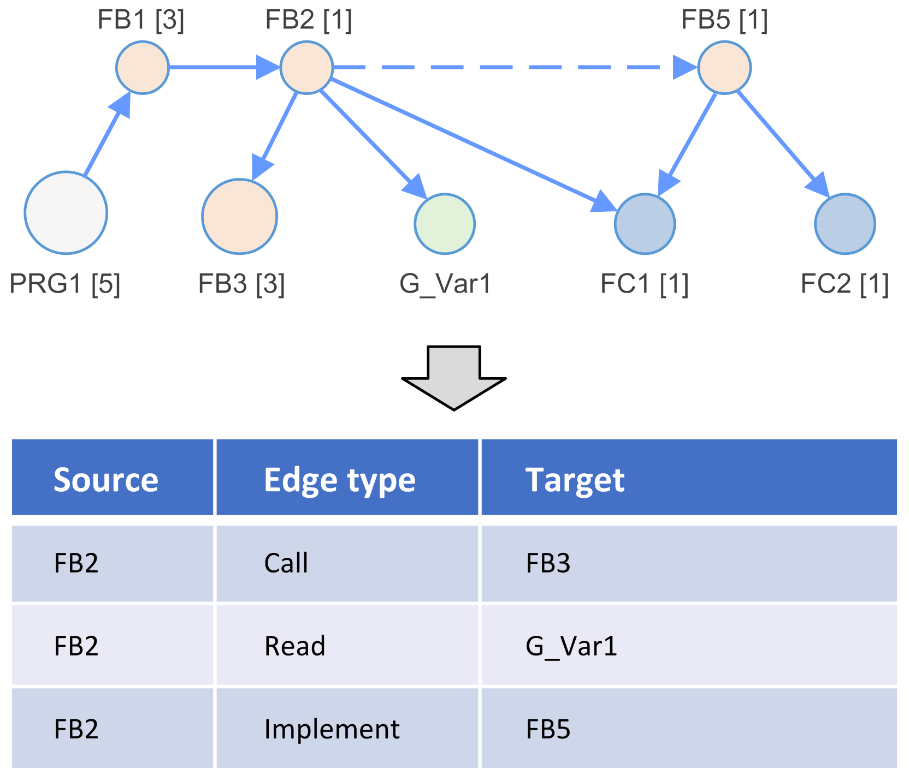

# Concept of Code Analysis

## Overview

This chapter gives an overview on the concepts of Code Analysis as integrated into EcoStruxure Machine Expert.

## Software Components of Code Analysis

The diagram gives an overview of the high-level software components of Code Analysis:



The components can be categorized into three different types:

* UI components displaying data:

  + Editors to write the source code.
  + Editors to visualize the results like metrics or conventions, or a graphical representation of the source code structure.
* Data models as input or output of other components:

  + Language model
  + Dependency model
  + Resource Description Framework (RDF) model
  + Query results
* Components transforming data:

  + The source code compiler (with language model as output) processes the source code to check the syntax and build the language model to generate the executable code running on controllers.
  + The source code analyzer (with dependency model as output) analyzes the language model and transforms it into a dependency model (and keeps it up-to-date).
  + The RDF model generator (with RDF model as output) transforms the dependency model into an RDF model to build the bridge to the semantic Web technologies.
  + The Query execution engine (with query results as output) executes SPARQL queries on the RDF model to get the query results.

## Analysis Data (Dependency Model) Concept

The application is analyzed and a dependency model is built.

The dependency model is a list of nodes connected through edges.



Examples of node types:

| Node type | Description |
| --- | --- |
| Function block | Function block (FB) inside the dependency model. Created for every function block added to the EcoStruxure Machine Expert project. |
| Program | Progam (PRG) inside the dependency model. Created for every program added to the EcoStruxure Machine Expert project. |
| Function | Function (FC) inside the dependency model. Created for every function added to the EcoStruxure Machine Expert project. |
| ... | ... |

Examples of edge types:

| Edge type | Description |
| --- | --- |
| Read | Read operation from code as source to a variable node as target. |
| Write | Write operation from code as source to a variable node as target. |
| Call | Call of a function block, method, action, program, and so on, from the code as source to a target node. |
| Extend | Extension of a basis type. For example, FB extension by another function block. |
| ... | ... |

## Semantic Web Technologies

The open and flexible code analysis feature is based on semantic Web technologies. Some of these technologies are:

* Resource Description Framework (RDF) - RDF Model

  Refer to <https://en.wikipedia.org/wiki/Resource_Description_Framework>.
* RDF Database (Semantic Web Database) - an RDF Triple Storage

  Refer to <https://en.wikipedia.org/wiki/Triplestore>
* SPARQL Protocol and RDF Query Language - SPARQL.

  Refer to <https://en.wikipedia.org/wiki/SPARQL>.

## Dependency Model to RDF Model Synchronization

The dependency model is the result of a code analysis run.

To link up to an open, flexible code analysis feature with query language support, the dependency model is synchronized with an RDF model.



## RDF Triple Storage

To support the analysis of large projects, the RDF model is kept in a separate process called RDF Triple Storage.

By default, the RDF Triple Storage is used. If required, the behavior can be configured in the Code Analysis Manager.

## SPARQL and RDF

Resource Description Framework (RDF) is a data model for describing resources and the relations between these resources.

Example:

| :(Subject) | :(Predicate) | :(Object) |
| --- | --- | --- |
| `:Car` | `:Weights` | `:1000 kg` |
| `:Car` | `:ConsistsOf` | `:Wheels` |
| `:Car` | `:ConsistsOf` | `:Engine` |

SPARQL is an acronym for Sparql Protocol and RDF Query Language. The SPARQL specification ([https://www.w3.org/TR/sparql11-overview/](https://www.w3.org/TR/sparql11-overview)) provides languages and protocols to query and manipulate RDF graphs - similar to SQL queries.

Example of s simple SPARQL query to get the node Ids and their names of the function blocks of an RDF model:

```
SELECT ?NodeId ?Name
WHERE {
       # Select all FunctionBlocks and their names
       ?NodeId a :FunctionBlock ;
             :Name ?Name .
}
```

EIO0000002710.08