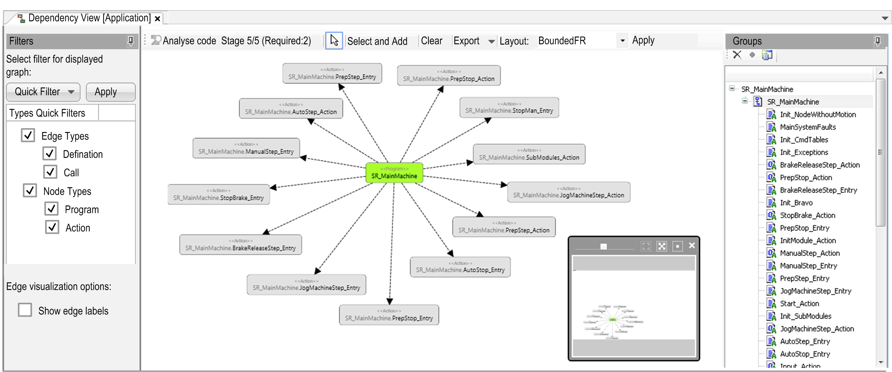

# Dependency View (Overview)

## Overview

With the Dependency View, you can visualize the dependencies of your analyzed application as a dependency graph. You can select the content and the layout of the dependency graph.

The Dependency View provides three parts:

* Filters [(left-hand side)](D-SE-0071556.html#D-SE-0071556)

  You can filter and configure the dependency graph.
* Dependency Graph [(main window)](D-SE-0070511.html#D-SE-0070511)

  The displayed graph represents dependencies between elements of the analyzed application.
* Groups [(right-hand side)](D-SE-0071552.html#D-SE-0071552)

  You can structure the application using the Groups tree.

EIO0000002710.08