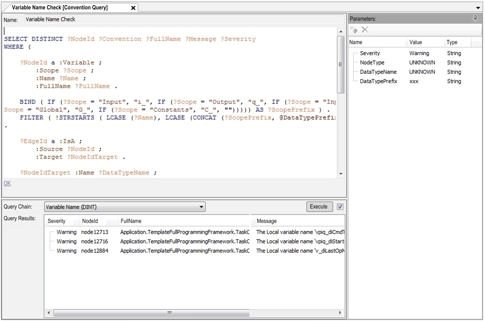

# Query Editor

## Overview

With the Query Editor, you can edit or create user-defined queries.

The main window of the Query Editor provides two parts:

* SPARQL Editor
* Query Results

Rightmost the Query Editor provides the Parameters Editor.

## SPARQL Editor

| Element | Description |
| --- | --- |
| Name | Edit the query name. |
| SPARQL Editor | Edit the SPARQL query. |
| Syntax validation messages | At the bottom of the query editor, detected SPARQL syntax errors are displayed. Click this message to jump to the detected syntax error in the query editor. |

## Query Results

| Element | Description |
| --- | --- |
| Query Chain | Queries can only be executed in the environment of a query chain. If a query is already assigned to query chains, these query chains are available in this list. There is also a default query chain without parameters available. |
| Query Results | The results of a query are displayed in this Query Results table. |
| Execute check box | Deselect this check box to disabled automatic query execution. |
| Execute button | Click this button to start execution. |

## Parameters Editor

The Parameters Editor displays the parameters for the query.

Refer to [Parameters Editor](D-SE-0070603.html#D-SE-0070603).

EIO0000002710.08