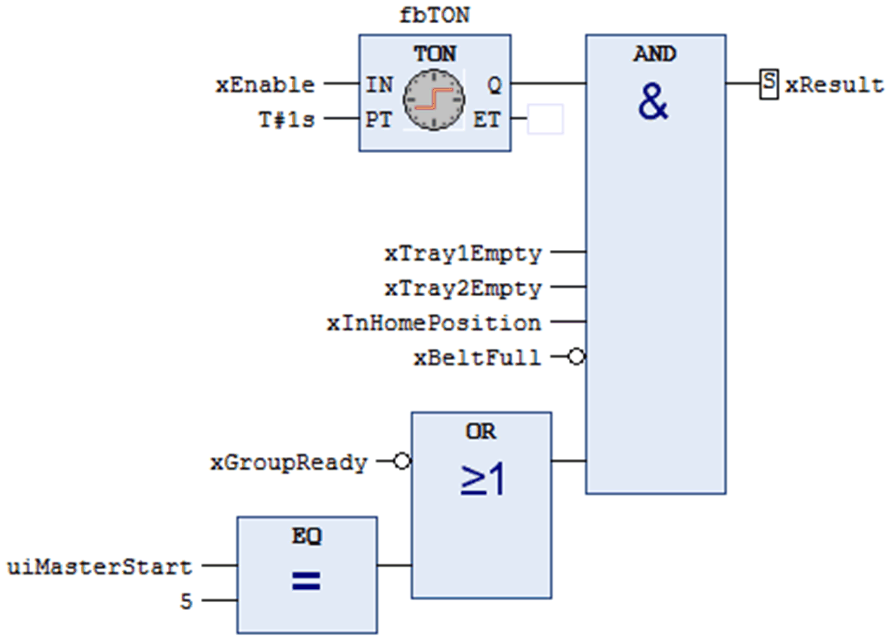

# Metric: Halstead Complexity

## User Description

The Halstead complexity metric is used to measure the complexity of a software program without running the program itself.

This metric is a static testing method where measurable software properties are identified and evaluated. The source code is analyzed and broken down to a sequence of tokens. The tokens are then classified and counted as operators or operands.

The operators and operands are classified and counted as follows:

| Parameter | Description |
| --- | --- |
| n1 | Number of distinct operators |
| n2 | Number of distinct operands |
| N1 | Total number of operators |
| N2 | Total number of operands |

There are a number of metric values that can be calculated to represent different aspects of complexity:

* Halstead Difficulty (D)
* Halstead Length (N)
* Halstead CalculatedLength (Nx)
* Halstead Volume (V)
* Halstead Effort (E)
* Halstead Vocabulary (n)

## Halstead Complexity for POUs Implemented in Structured Text (ST)

The Halstead complexity was originally developed for textual languages (like C, C++, Pascal, etc.) and is applicable to POUs implemented in structured text (ST).

NOTE: By default, the Halstead Difficulty is displayed.

## Halstead Complexity for POUs Implemented in Function Block Diagram (FBD)

The function block diagram (FBD) belongs to the group of graphical implementation languages and is not text-based. A POU consists of multiple FBD networks. Then the Halstead complexity metric must be adapted to be applicable to graphical languages. Operands and operators and their frequency (per FBD network) are considered as presented to the user (see Example for function block diagram (FBD)).

The Halstead complexity results calculated per FBD network are aggregated across the FBD networks and attached on POU (program, function block, function, method, or property) level.

NOTE: The calculated Halstead values (per FBD network) are FBD Network Halstead Difficulty and FBD Network Halstead Length.

The following aggregation types are applied per FBD network Halstead metric values (Halstead Difficulty and Halstead Length):

* Average
* Minimum
* Maximum
* Sum
* Consistency

NOTE: The most relevant aggregated values are FBD Halstead Difficulty Network Max, FBD Halstead Difficulty Network Consistency, FBD Halstead Length Network Max, and FBD Halstead Length Network Consistency. All other combinations (Min, Sum, and Average) are calculated and attached to the model but not displayed by default.

## Metric Calculation

| Value | Formula |
| --- | --- |
| Halstead Difficulty (D) | D = (n1 / 2) \* (N2 / n2) |
| Halstead Length (N) | N = N1 + N2 |
| Halstead CalculatedLength (Nx) | Nx = n1 \* log2(n1) + n2 \* log2(n2) |
| Halstead Volume (V) | V = N \* log2(n) |
| Halstead Effort (E) | E = V \* D |
| Halstead Vocabulary (n) | n = n1 + n2 |

NOTE: An expression in an IF <expression> THEN statement must not have parenthesis. They are considered as always available.

## Metric Aggregation

Metric results like FBD Network Halstead Difficulty and FBD Network Halstead Length are aggregated across the FBD networks of a POU.

The values are the list of values of the same metric (for example, FBD Network Halstead Length) of the FBD networks of a POU.

The consistency value is a result of the Gini coefficient. The Gini coefficient is a measure of statistical dispersion. It measures the inequality among values of a frequent distribution. A Gini coefficient of 0 expresses equality, where all values are the same. A Gini coefficient of 1 expresses maximum inequality among values.

**Example for structured text (ST)**

Halstead calculation example (only the implementation part is considered for calculation):

```
IF (xInit = FALSE) THEN

    PerformInitialization();
    xInit := TRUE;

ELSE

    FOR i := 1 TO 5 DO

        iAxisId := i + 7;
        sAxisName := Standard.CONCAT('MyAxis ', INT_TO_STRING(iAxisId));

        // Do some math calculations for each axis here
        udiResult := CalculateStuff(sName := sAxisName, iID := iAxisId);
    END_FOR

END_IF
```

**List of Operators and its Frequencies:**

```
Operator                            Frequency
========                            =========
(operators)
If                                          1
Then                                        1
LeftParenthesis                             6
RightParenthesis                            6
Equal                                       1
Semicolon                                   5
Assign                                      7
Else                                        1
For                                         1
EndFor                                      1
Do                                          1
Plus                                        1
Period                                      1
INT_TO_STRING                               1
Colon                                       2
EndIf                                       1
(n1)  16                             (N1)  37
```

**List of Operands and its Frequencies:**

```
Operand                             Frequency
=======                             =========
(variables/methods/functions)
xInit                                       2
PerformInitialization                       1
i                                           2
iAxisId                                     3
sAxisName                                   2
Standard                                    1
CONCAT                                      1
udiResult                                   1
CalculateStuff                              1
sName                                       1
iID                                         1

(constants)
FALSE                                       1
TRUE                                        1
INT#1                                       1
INT#5                                       1
INT#7                                       1
'MyAxis '                                   1
(n2)  17                             (N2)  22
```

**Halstead Difficulty Result**

```
Halstead Difficulty (D = (16/2) * (22/17) = 10.3529411764706
```

**Example for function block diagram (FBD)**

Halstead calculation example implemented in FBD (only the implementation part is considered for calculation):



**List of Operators and its Frequencies:**

```
Operator                            Frequency
========                            =========
(operators)
Assign                                      4
Set2                                        1
And                                         1
Negation2                                   2
Or                                          1
Eq                                          1
(n1)   6                             (N1)  10
```

**List of Operands and its Frequencies:**

```
Operand                             Frequency
=======                             =========
(variables/methods/functions/constants)
xResult                                     1
TON                                         1
fbTON                                       1
xEnable                                     1
T#1s                                        1
IN                                          1
PT                                          1
Q                                           1
ET                                          1
xTray1Empty                                 1
xTray2Empty                                 1
xInHomePosition                             1
xBeltFull                                   1
xGroupReady                                 1
uiMasterStart                               1
5                                           1
(n2)  16                             (N2)  16
```

**FBD Network Halstead Difficulty Result**

```
FBD Network Halstead Difficulty (D) = (6/2) * (16/16) = 3
```

**FBD Network Halstead Length**

```
FBD Network Halstead Length (D) = 10 + 16 = 26
```

EIO0000002710.08