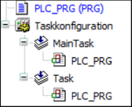

# Compiler Error C0164

## Message

POU <name> writes to output <name> and is called in several tasks.

## Message Cause

The device setting `codegenerator\check-multiple-task-output-write` is set and multiple tasks access the same output.

NOTE: The error is generated during the command Generate Code.

## Solution

Do not call a program that changes outputs in multiple tasks.

## Error Example



```
PROGRAM PLC_PRG
VAR
  Output AT %QB7 : BYTE;
END_VAR
```

```
Output := 0;
```

-->C0164: POU ‘PLC\_PRG’ writes to output ‘%QB7’ and is called in several tasks.

EIO0000003933.04