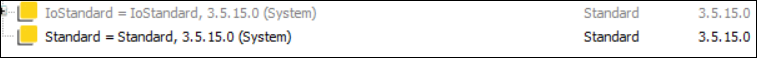

# Compiler Error C0180

## Message

Ambiguous namespace ‘<library 1>’ defined by library ‘<library 2>’.

## Message Cause

The namespace of the library <library 1> is not unique. It is already used for <library 2>.

## Solution

Change the namespace of the library accordingly (either in the library or in the project via the Properties button in the Library Manager).

## Error Example

-->C0180: Ambiguous namespace ‘<STANDARD>’ defined by library ‘Standard, 3.5.15.0 (System)’.

EIO0000003933.04