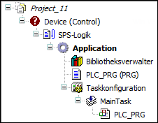

# Compiler Error C0188

## Message

Device not installed to the system. No code generation possible.

## Message Cause

The desired device is not installed.

## Solution

Install the missing device in the device repository, or replace the existing device already inserted in the device tree with another existing device (Update Device).

## Error Example

-->C0188: Device is not installed to the system.

EIO0000003933.04