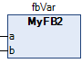
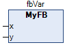

# Compiler Error C0225

## Message

‘<name>’ is not an instance of ‘<name>’.

## Message Cause

A function block in a graphical programming language has been assigned with an explicit type that does not match the declared type.

## Solution

Replace the explicit type with the one used in the declaration part, or remove the specification of the explicit type from the POU.

## Error Example



```
PROGRAM PLC_PRG
VAR
  fbVar : MyFB;
END_VAR
```

-->C0225: ‘fbVar’ is not an instance of ‘MyFB2’.

## Error Correction



EIO0000003933.04