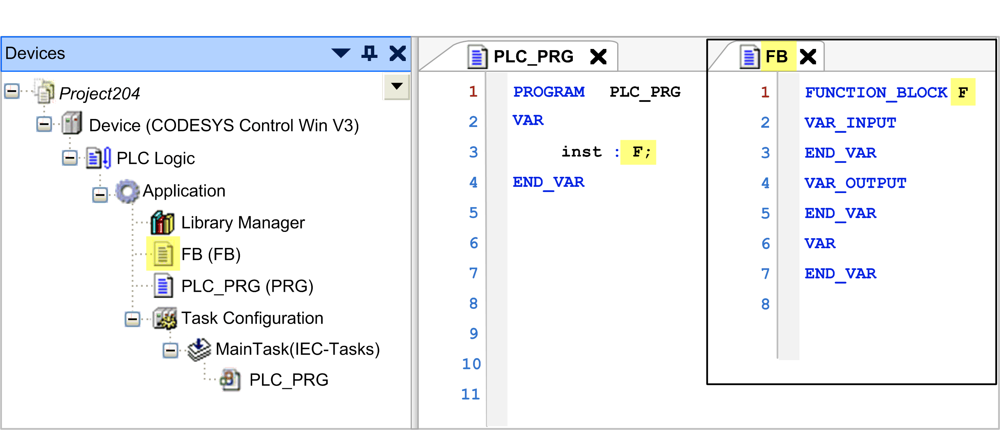

# Compiler Error C0243

## Message

The name used in the signature is not identical with the object name

## Message Cause

The object name differs from the name used in the code.

## Solution

Make sure that the name of the object in the tree is the same as the name in the declaration and code part.

## Error Example

EIO0000003933.04