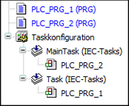

# Compiler Error C0332

## Message

Variable ‘<variable name>’, which is mapped on address ‘<address>’ is written in different tasks.

## Message Cause

A controller-specific device setting is set and multiple tasks access the same output.

Example for a controller-specific device setting:

```
codegenerator\check-multiple-task-output-write
```

NOTE: The error is generated during the command Generate Code.

## Solution

Write an output in one fixed task only. If multiple tasks need to calculate data for one output, then you should try to transfer this information by means of global variables to one fixed task, which then writes the data to one output.

## Error Example



```
PROGRAM PLC_PRG_1
VAR
    Output AT %QB7 : BYTE;
END_VAR
```

```
Output := 0;
```

```
PROGRAM PLC_PRG_2
VAR
    Output AT %QB7 : BYTE;
END_VAR
```

```
Output := 1;
```

-->C0332: Variable ‘Output’, which is mapped on address ‘%QB7’ is written in different tasks.

EIO0000003933.04