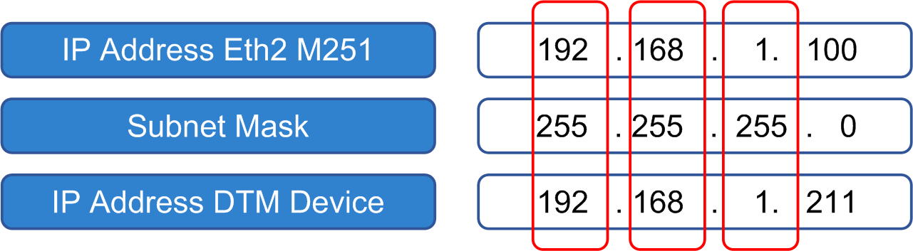

# Manual IP Address Setting

Manual IP Address Setting

oThe IP address in the DTM configuration must match the actual IP address of the device. Verify the IP address of the device itself (display or similar).

oVerify that the IP address is not been occupied by another device in the network (verify by pinging the address over Ethernet, or consult your Information Systems manager).

oVerify that the IP address of the Ethernet port of the controller is set as a gateway address in the device.

oVerify that your device is in the same subnet as defined by the IP address settings of the Ethernet port of the controller.

