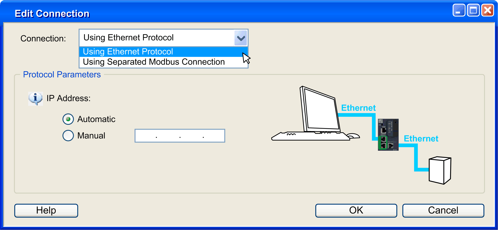

# Edit Connection Window

Edit Connection Window

Overview

The Edit Connection window allows you to define an alternative communication channel between the DTM and the device. This is used in the following cases:

oYou want to connect the device with an intermediate IP address, different from the address configured in the project (for example, the default address)

oYour PC is connected to the controller via USB, this communication channel is not suitable for communications between the DTM and the device. You can switch to another protocol to make the configuration (for example with a TSXCUSB485 USB to Modbus SL dongle).

Right-click the device node in the Devices tree and click Edit Connection... to display the Edit Connection window:

Description

This table describes the Edit Connection window:

| Item | | Description |
| --- | --- | --- |
| Connection | | Selects the connection type from the drop-down list:  oUsing Ethernet Protocol: connection through an Ethernet protocol (Modbus TCP or EtherNet/IP).  oUsing Separated Modbus Connection: connection through the Modbus serial line port of the device. |
| Protocol Parameters | | Defines the associated parameters of the selected protocol. |
| Using Ethernet Protocol | IP Address | Selects the addressing mode:  oAutomatic: the IP address is automatically retrieved from the project configuration.  oManual: enter the device IP address. |
| Using Separated Modbus Connection | COM Port | Selects the COM Port from the drop-down list.  NOTE: If the port is not in the list, click the Refresh button. |
| Modbus Address | Selects the Modbus Serial Line address:  oAutomatic: the Modbus Serial Line address is automatically selected.  oManual: enter the Modbus Serial Line address of the device. |

NOTE: If the protocol is changed, the device is displayed in red in the Devices tree to inform that this setting is for temporary use.

EIO0000003047.00

© 2019 Schneider Electric. All rights reserved.