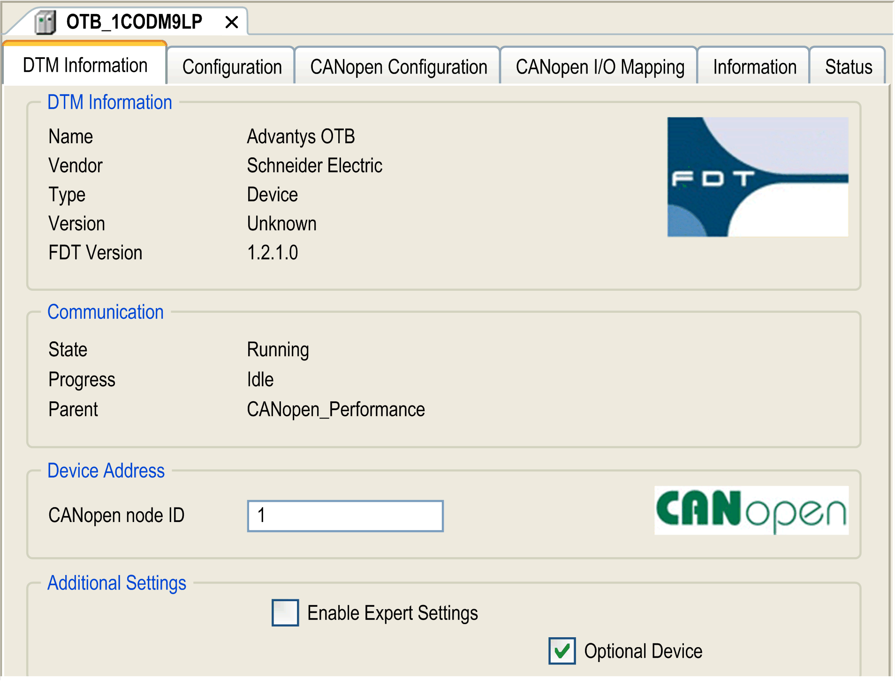

# Adding and Configuring an OTB CANopen Interface DTM

Adding and Configuring an OTB CANopen Interface DTM

Overview

Verify that the OTB DTM is installed on your computer and in your device repository before starting.

The CANopen interface DTM provides dialogs or functions for configuration and maintenance of the [devices](../DTMs_in_ESME/DTMs_in_ESME-6.htm#XREF_D_SE_0008095_1).

| Step | Action |
| --- | --- |
| 1 | To add an OTB CANopen interface DTM to your controller, select OTB 1C0DM9LP in the Hardware Catalog, drag it to the Devices tree, and drop it on one of the highlighted nodes, then select OTB 1C0DM9LP Advanced Settings.  For more information on adding a device to your project, refer to:  • Using the Drag-and-drop Method  • Using the Contextual Menu or Plus Button |
| 2 | Double-click the added node to access the device editor screen. |

Device Editor Screen

The figure shows the device editor screen:

The device editor screen contains the following tabs:

o[DTM Information](#XREF_D_SE_0012490_12)

o[Configuration](#XREF_D_SE_0012490_13)

o[CANopen Configuration](#XREF_D_SE_0012490_18)

o[CANopen I/O Mapping](#XREF_D_SE_0012490_17)

o[Information](#XREF_D_SE_0012490_14)

o[Status](#XREF_D_SE_0012490_15)

DTM Information Tab

| Section | Description |
| --- | --- |
| DTM Information | General information about the CANopen interface DTM. |
| Communication | Monitoring of the state, progress, and parent of the CANopen interface. |
| Device Address | The node [ID](../glossary/glossary.htm#XREF_D_SE_0024697_575) (device address) serves to identify the CAN DTM uniquely and corresponds to the set number on the device itself which is from 1 to 126. Enter the ID as a decimal number. |
| Additional Settings | Enable Expert Settings: This enables additional CANopen settings in the DTM Information tab and in the Status tab.  Optional Device: If this option is activated, the master will try to read from this node only once. If the node does not answer, it will be ignored. |

When selecting the Enable Expert Settings option, additional configuration elements appear in the DTM Information tab:

| Section | Description |
| --- | --- |
| Additional Settings | SDO Channels...: This button displays the SDO channel configuration.  Reset Node: This option is activated by default. Resets the CANopen communication parameters of the slaves to their default values before downloading the new configuration. The parameters which can be reset depends on the device used. The subindex defines which configuration parameter is to be set. For example, by default via subindex 2 (1000h to 1FFFh, object 1011h), the CANopen communication settings are addressed. Refer to the CANopen standard for more information about objects.  No Initialisation: When this option is activated, the master activates the node without sending configuration SDOs (The [SDO](../glossary/glossary.htm#XREF_D_SE_0024697_49) data nevertheless will be created and saved on the controller). |
| Node Guard | When this option is activated, a message will be sent to the device according to the Guard Time interval (in milliseconds, 200 by default).  If the device does not then send a message with the given Guard COB-ID (Communication Object Identifier), it will receive the status ’timeout’. As soon as the number of attempts (Life Time Factor; 2 by default if there are no other default settings within the device configuration file or if this default setting equals 0) has been reached, the device will receive the status "not OK". The status of the device will be stored in a diagnostic object.  NOTE: No monitoring of the device will occur if the variables Guard Time and Life Time Factor are not defined (=0). |
| Emergency | When this option is activated, a device will send an emergency message with a unique COB-ID, as soon as an internal error is detected. These messages, which vary from device to device, are stored in a diagnostic object. |
| Heartbeat | Enable Heartbeat Producing: When this option is activated, the device will send heartbeats according to the interval defined in Heartbeat Producer Time (in [ms](../glossary/glossary.htm#XREF_D_SE_0024697_584), 200 by default or if this setting equals 0).  Change Properties Heartbeat: This button opens a dialog to enter the desired value in milliseconds in the Heartbeat time field. If the Heartbeat Consumer option is activated, then the respective device will listen to heartbeats which are sent by the master. As soon as no more heartbeats are received, the device will switch off the [I/Os](../glossary/glossary.htm#XREF_D_SE_0024697_469). |
| Checks at Startup | This function compares the Check Vendor ID, Check Product Number, Check Revision Number object values with those configured in EcoStruxure Machine Expert. |

Configuration Tab

The DTM is opened in this tab.

For more information on the DTM, click the Help button within the Configuration tab or consult the documentation for the particular DTM.

CANopen Configuration Tab

This tab provides a summary of the CANopen configuration parameters.

CANopen I/O Mapping Tab

This tab is the standard Device Editor dialog for the configuration of the I/O-mapping of a device, that is for assigning [IEC](../glossary/glossary.htm#XREF_D_SE_0024697_75) variables to input and output channels of the hardware.

Information Tab

This tab displays general information about the device (name, description, provider, version, image).

Status Tab

This tab provides status information (for example "Running", "Stopped") and device-specific diagnostic messages.

When Enable expert settings is selected, [NMT](../glossary/glossary.htm#XREF_D_SE_0024697_153) and SDO commands are available.

EIO0000003047.00

© 2019 Schneider Electric. All rights reserved.