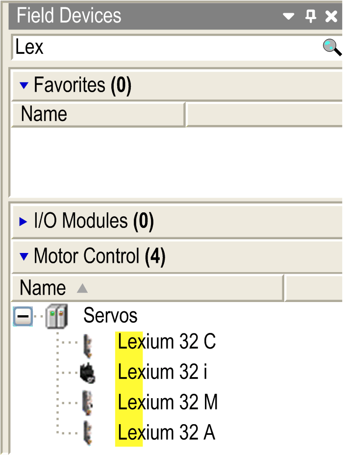

# Adding a Modbus TCP or EtherNet/IP DTM

Adding a Modbus TCP or EtherNet/IP DTM

Description

To add a DTM to your controller, select the required supported device in the Hardware Catalog, drag it to the Devices tree, drop it on one of the highlighted nodes, then select the corresponding DTM name.

For more information on adding a device to your project, refer to:

• Using the Drag-and-drop Method

• Using the Contextual Menu or Plus Button

NOTE: The corresponding protocol manager is automatically added to the Ethernet port (it is also possible to add it manually).

You can use the search function  of the Hardware Catalog to filter the devices:

Supported Devices

This table lists the supported devices:

| Supported device | DTM name | Modbus TCP | EtherNet/IP |
| --- | --- | --- | --- |
| Altivar 320 | Altivar 320 | Yes | Yes |
| Altivar 340 | Altivar 340 | Yes | Yes |
| Altivar 6••(1) | Altivar 6•• | Yes | Yes |
| Altivar 9•• | Altivar 9•• | Yes | Yes |
| Lexium 32 M | Lexium 32 M | Yes | Yes |
| Harmony XB5R | ZBRN1 | Yes | No |
| (1) This does not include Altivar 61. | | | |

NOTE: Some third-party DTM can also be supported if they provide Modbus TCP communication capabilities.

Modbus TCP and EtherNet/IP DTM Compatibility

The TM251MESE, TM241CE24•, and TM241CE40• controllers support the Modbus TCP and EtherNet/IP DTMs on the Industrial Ethernet port.

Industrial Ethernet Manager

The Industrial Ethernet Manager is a mandatory node in a Modbus TCP or EtherNet/IP configuration with DTMs.

NOTE: For more information about the configuration of the Industrial Ethernet Manager, refer to [Industrial Ethernet Manager Configuration](../../../../../../api/crossBook?lang=en-US&virtualBookName=ESMEEtherNetIP&topicID=D_SE_0056936_1).

EIO0000003047.00

© 2019 Schneider Electric. All rights reserved.