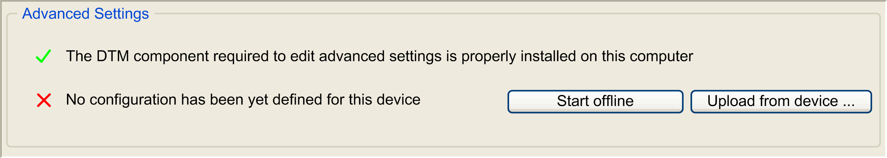
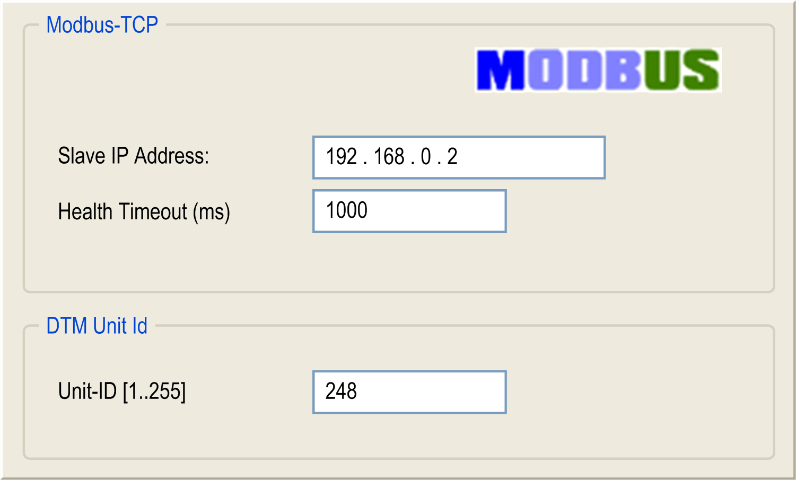

# Adding and Configuring a Device with DTM via Modbus TCP

Adding and Configuring a Device with DTM via Modbus TCP

Overview

Verify that the [device DTM](../DTMs_in_ESME/DTMs_in_ESME-3.htm#XREF_D_SE_0007249_1) is installed on your computer and installed in your device repository before starting.

| Step | Action |
| --- | --- |
| 1 | To add a device to your controller, select the device in the Hardware Catalog, drag it to the Devices tree, drop it on one of the highlighted nodes, then select the corresponding DTM name.  For more information on adding a device to your project, refer to:  • Using the Drag-and-drop Method  • Using the Contextual Menu or Plus Button |
| 2 | Double-click the added node to access the device editor screen. |

Device Editor Screen

The device editor screen contains the following tabs:

o[Overview](#XREF_D_SE_0038302_24)

o[Modbus TCP Slave Configuration](#XREF_D_SE_0038302_20)

o[Modbus TCP Channel Configuration](#XREF_D_SE_0038302_25)

o[ModbusTCPSlave I/O Mapping](#XREF_D_SE_0038302_17)

o[Configuration of the device](#XREF_D_SE_0038302_23)

o[Status](#XREF_D_SE_0038302_15)

o[Information](#XREF_D_SE_0038302_14)

Overview Tab

This tab indicates if a DTM is installed and if a configuration exists.

This illustration presents the Overview tab:

This table describes the available buttons of the Overview tab:

| Button | Description |
| --- | --- |
| Start offline | Creates an offline device configuration.  NOTE: The Configuration of the device tab is created and opens when clicking the button. |
| Upload from device... | Uploads the parameters from the device to the PC and creates the Configuration of the device tab. |
| Edit configuration | Displays the Configuration of the device tab (only if a configuration has been already defined). |
| Install component | Opens the Machine Expert Installer for installing the missing components. |

Modbus TCP Slave Configuration Tab

This figure illustrates the Modbus TCP slave configuration tab:

| Section | Description |
| --- | --- |
| Modbus-TCP | Slave IP Address: Configure the IP address of the drive.  Health Timeout (ms): Configure the Modbus TCP IOScanner timeout in ms (default 1000 ms). It represents the maximum delay between a request of the Modbus TCP IOScanner and a response of the slave. |
| DTM Unit Id | Unit-ID [1...255]: If a gateway from Modbus TCP to Modbus SL is used, configure the address of the device on the Modbus SL fieldbus, otherwise the DTM Unit Id must be set to 248. |

Modbus TCP Channel Configuration Tab

This tab is the standard device editor dialog for the configuration of the Modbus TCP channel of a device.

ModbusTCPSlave I/O Mapping Tab

This tab is the standard device editor dialog for the configuration of the I/O-mapping of a device, that is for assigning [IEC](../glossary/glossary.htm#XREF_D_SE_0024697_75) variables to input and output channels of the hardware.

Configuration of the Device Tab

The DTM is opened in this tab.

For more information on the DTM, click the Help button within the Configuration tab or consult the documentation for the particular DTM.

Status Tab

This tab provides status information (for example "Running", "Stopped") and device-specific diagnostic messages.

Information Tab

This tab displays general information about the device (name, description, provider, version, image).

EIO0000003047.00

© 2019 Schneider Electric. All rights reserved.