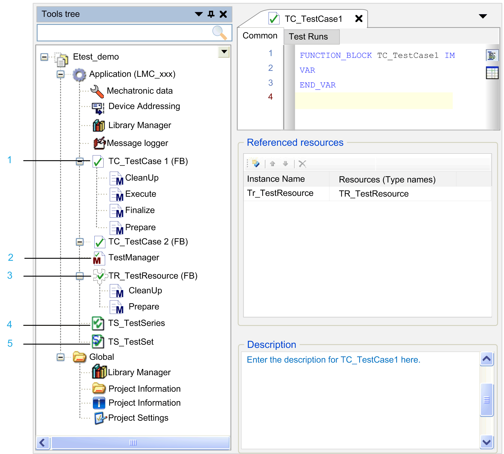

# ETEST Objects

## Overview

The graphic presents the ETEST objects available in the Logic Builder Tools tree as subnodes of an Application node:

| Legend item | ETEST object | Description |
| --- | --- | --- |
| 1 | TestCase | * Central component of the ETEST framework. * Basically a function block. It uses the object-oriented extensions of the IEC 61131-3 standard that are available in Logic Builder. * Implements the interface IF\_TestCase. * Contains [methods](D-SE-0061018.html#D-SE-0061018), which in turn can use [macros](D-SE-0061040.html#D-SE-0061040). |
| 2 | TestManager | * A test manager is an administration function block. Test cases and test series are performed using this function block as a sub process of the associated application. * If tests are executed for an application, the following conditions must be fulfilled:    + A TestManager object must be available as a subnode of the Application node.   + A task must reference this object. Both are automatically created if you insert an ETEST object under an Application node. |
| 3 | TestResource | * Encapsulates the access to as well as the initialization of hardware and larger data structures used by test cases. The ETEST framework creates only one instance per resource.  The ETEST framework initializes the resources before they are used (by calling their Prepare method). The ETEST framework de-initializes resources after they have been used (by calling their CleanUp method). * Before a test case is executed, the ETEST framework verifies that the resources integrated into this test case are initialized and that the case is given a reference to the instance of the resource. After the test case has been completed, the ETEST framework verifies that the resource is de-initialized again. * Further resources can be integrated in resources (as in test cases). Cyclical dependencies between resources are not allowed. |
| 4 | TestSeries | * Can be used for grouping test cases. * Can reference test cases or further test series. |
| 5 | TestSet | * A test set is a table. Each row defines one test run. Each column maps to one parameter used throughout the test. * Uses the IEC-STRUCT to define the parameter sets. Each variable in the IEC-STRUCT defines one parameter. You can fill the table cells with the initialization values that are used for each test run. * Using an IEC-STRUCT allows you to define specific parameter sets or reuse existing IEC-STRUCT (for example, from a library). |

NOTE: An ETEST object can be executed if the following conditions apply:

* It is a TestCase or a TestSeries object that is a subnode of the Application node.
* It has been selected by an executable TestSeries.

Example: A TestCase which is a node of the Tools tree can be executed if it is selected in a TestSeries which is a subnode of an Application node.

EIO0000002878.02