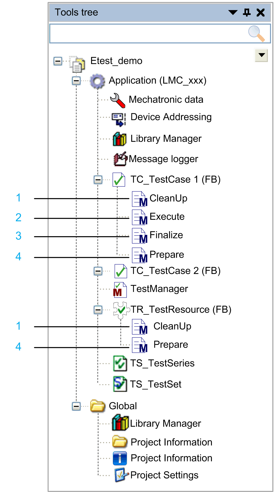
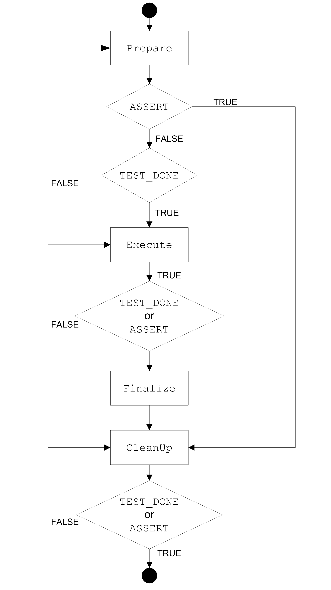

# Methods

## Overview

Test cases and resources contain predefined methods. These methods are called by the test framework during test execution. The contents of these methods, the test logic, is programmed by you as a user. The methods predefined by the ETEST framework do not differ in their behavior from the general [methods described in the EcoStruxure Machine Expert Programming Guide](../../../../../api/crossBook?lang=en-US&virtualBookName=SoMProg&topicID=D_SE_0083409).

**1** CleanUp: Cleaning after the test case.

**2** Execute: Execution of the test case.

**3** Finalize: Cleaning after the test case. (Called once in the cycle in which Execute is terminated.)

**4** Prepare: Preparation of the test case.

## Methods of Test Cases and Resources

Test cases contain the methods:

* Prepare
* Execute
* Finalize
* CleanUp

Resources contain the methods:

* Prepare
* CleanUp

These methods must be included in every test object. In addition, test cases and resources may contain any number of other methods.

NOTE: The methods of test cases and resources must only be written in structured text (ST). Otherwise an error may be generated.

## Sequence of Methods During Test Execution

During the execution of a test case, the methods are called by the ETEST framework in the following sequence, regardless of the order that they appear in the Tools tree:

| Sequence | Method | Call type | Description | End condition |
| --- | --- | --- | --- | --- |
| 1 | Prepare | Cyclic | Preparatory measures for the test are executed, for example, initialization of variables or positional control of an axis. | * The macro `ASSERT` has been evaluated to FALSE. * Initialization has been successfully completed. (The macro `TEST_DONE` is called.) |
| 2 | Execute | Cyclic | Contains the test itself. | * The macro `ASSERT` has been evaluated to FALSE. * The test has been successfully completed. (The macro `TEST_DONE` is called.) |
| 3 | Finalize | Once | The method is called up if the following conditions apply:   * The method Execute is exited with a detected error. * The method Execute is exited regularly at the end of the test case in the same cycle. * The method Execute is canceled by user input. | Is directly followed by the CleanUp method. |
| 4 | CleanUp | Cyclic | Resets the test object to the initial state. It can then be reused later. | * The macro `ASSERT` has been evaluated to FALSE. * The test has been successfully completed. (The macro `TEST_DONE` is called.) |

During the execution of a test case, one method of a test case is called in each cycle. An exception is the method Finalize, which is used in the same cycle as the last call of Execute.

Within the methods of test cases and resources, [macros](D-SE-0061040.html#D-SE-0061040) can be used.

## Calling Methods

The diagram illustrates how the ETEST framework calls test methods.

NOTE: The local variables of TestCases are re-initialized at the beginning of each test execution.

EIO0000002878.02