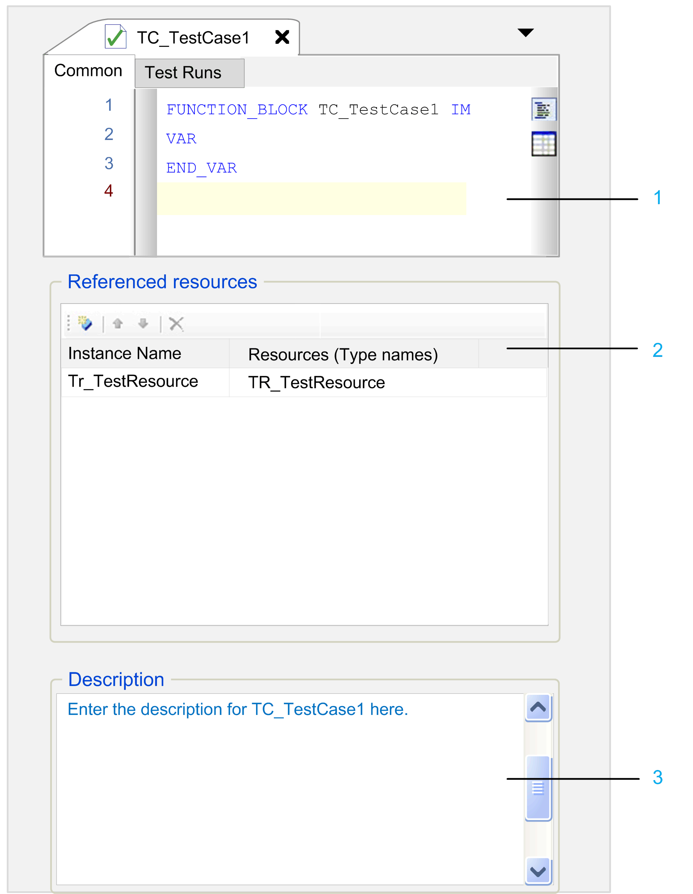
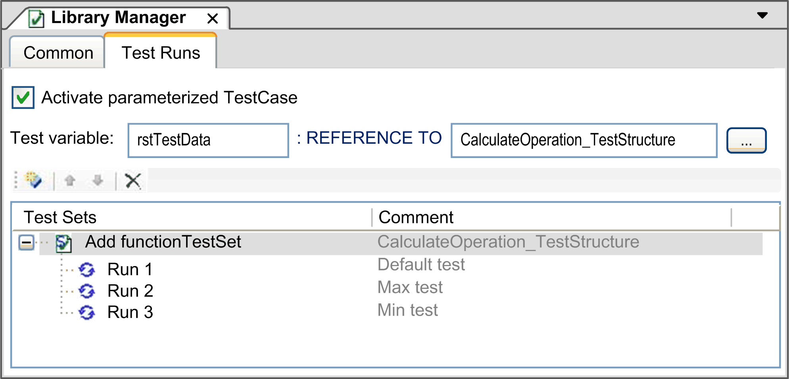

# Edit Test Cases

## Overview

The structure of test cases is similar to function blocks, but there is no editor available for the implementation section. Only the methods of test cases are implemented. To implement the test case, use the method editor by double-clicking the method in the Tools tree.

## Common

Common tab

**1** The declaration editor corresponds to the declaration section of a function block. You can switch between the text view and the table view of the editor using the buttons **Textual** and **Tabular**.

**2** The **Referenced resources** area provides integrated test resources.

**3** The **Description** area provides space for explanations regarding the test case.

## Test Runs

The tab Test Runs provides the configuration of test sets.

| Button / box | Description |
| --- | --- |
| Activate parameterized TestCase | The configured test runs are automatically executed with the test case. |
| Start Test | Clicking Start test from the contextual menu of a single test run, executes the selected test run. |
| Insert | Clicking Insert adds a new Test Set entry. With an additional double-click on the test set cell, you can enter a reference to a test set.  The existing test set names are suggested as you type.  When adding the first test set, the field REFERENCE TO is automatically set to the test data type of the newly added Test set.  NOTE: All configured test sets in one test case have to reference the same data type; otherwise a compiler error is detected. |
| Test Variable | The variable name that can be accessed by the code.  The default name is rstTestData, but it can be changed. |

## Navigation

You can use the Go To Definition… command from the contextual menu to navigate from a test case to the artifacts used. This function can be used for the configured test data type (IEC-STRUCT) as well as for the referenced test sets. Selecting one of these objects and clicking the Go to definition… command opens the corresponding editor for this object.

In addition, the table for referencing test sets also supports editing commands.

EIO0000002878.02