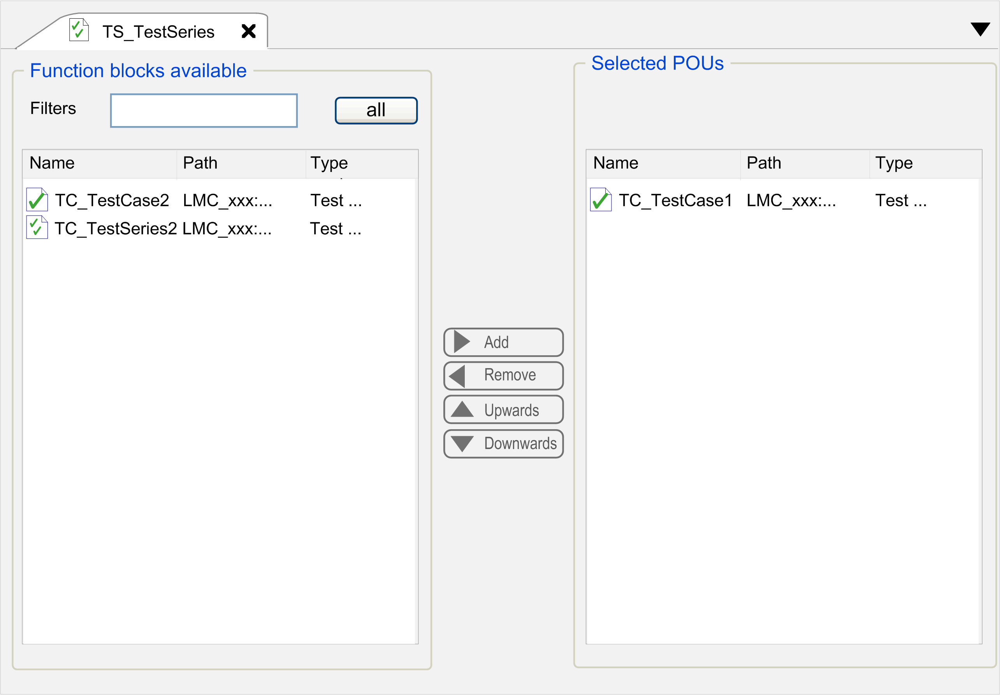

# Use Test Series

## Overview

One project comprises several test cases. The TestSeries editor allows you to group several test cases into a test series to execute them in a sequence.

The TestSeries editor consists of two areas:

| Area | Description |
| --- | --- |
| Function blocks available | This list includes test cases and test series that are subnodes of the same Application node as the open test series. It also lists those test cases and test series that are located in the Tools tree. You cannot select a test series as a subnode of itself.  Cyclical references between test series are not allowed. |
| Selected POUs | The selected POUs are displayed. The POUs are the test cases.  A test series can select a POU directly only once.  Indirectly, POUs can be selected several times. It is thus possible that test series embed other test series, and that these embedded test series in turn contain the same test case. |

| Button / box | Description |
| --- | --- |
| Add | Moves a selected test case from the list Function blocks available into the list Selected POUs. |
| Remove | Moves a selected test case from the list Selected POUs to the list Function blocks available. |
| Upwards | Moves a test case in the area Selected POUs up in the list. |
| Downwards | Moves a test case in the area Selected POUs dow in the list. |
| Filters  all | Enter a text in the Filters field to filter the list of Function blocks available in accordance with the entry. Click the button all to clear the filter. |

| Mouse or Keyboard Action | Description |
| --- | --- |
| Double-click | Double-click an entry in the Function blocks available list to shift it to the Selected POUs list and vice versa. |
| Delete key | Moves a selected test case from the list Selected POUs to the list Function blocks available. |
| Ctrl+A shortcut | Selects all entries of the list. |

EIO0000002878.02