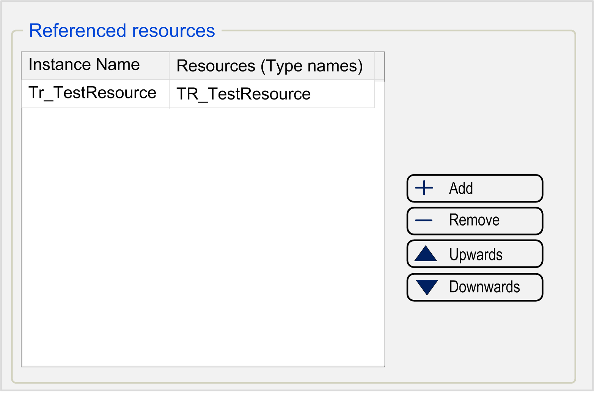

# Use Test Resources

## Overview

A test resource encapsulates the access as well as the initialization of hardware and larger data structures used by test cases. Resources are created and processed just as [test cases](D-SE-0060939.html#D-SE-0060939). A test case or a resource can bind a resource.

The declaration section for resources (Referenced resources) is located in the central area of the editor.

| Button | Description |
| --- | --- |
| + Add | Adds a test resource. |
| - Remove | Removes a test resource. |
| Upwards | Moves a selected test resource up in the list. |
| Downwards | Moves a selected test resource down in the list. |

| Mouse or Keyboard Action | Description |
| --- | --- |
| Double-click | Double-click an entry in the list of Referenced resources to edit it. |
| Delete key | Removes the test resource. |
| Ctrl+A shortcut | Selects all entries of the Referenced resources list. |
| Ctrl+click or  Shift+click shortcut | Selects several entries of the Referenced resources list. |

Each line of the table comprises a referenced resource. The column Instance name contains the name of the resource. This name is used if the resource is called from within a test object: A variable of this name is generated, which holds a reference for the resource.

The column Resources (Type names) contains the type name of the resource. This is the name of the test resource object which is to be integrated. In the online view, resources are displayed together with the other variables.

EIO0000002878.02