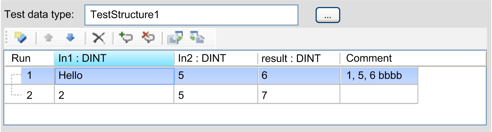

# Use Test Set

## Overview

Parameterized test cases can be used to run a test case (test code) against different parameter sets. Therefore, the object TestSet defines one or more test runs.

You can select a Test data type structure by clicking the … button that opens the Input Assistant dialog box or you can type directly in the Test data type input field. Changing the type updates the columns of the table with the test runs depending on the number of elements of the selected structure.

NOTE: The internal content of the table is not changed although the values are not displayed (hidden elements). The test only uses values of existing elements of the selected test data type. If an element is not defined, the default value is used. The elements are used in order of appearance, from left to right.

Type mismatches are displayed as compiler errors in the Messages window. Double-clicking opens the compiler error in the TestSet editor and marks the line causing the error.

| Button / box | Description |
| --- | --- |
| Insert | Add a new row.  If a row was selected before, the content of this row is copied into the new row. |
| Up / Down | Change the test run order.  The selected rows can be moved by clicking Up and Down. Additionally, you can define a new position of a test run by changing the value of the first column. |
| Delete | Delete all selected rows. |
| Add an automatically created comment | Add new comments.  The last column can contain a user-defined comment. By clicking Add an automatically created comment, a comment is automatically created for the selected rows of the table. The comment contains all values of the row separated by commas. |
| Clear comment | Clear the comments.  The comments of the selected rows are cleared by clicking Clear comment. |
| Export | Export .csv files.  The complete table is exported in a .csv file by clicking Export. The export file can also contain hidden elements. |
| Import | Import .csv files.  The complete table is imported from .csv file by clicking Import. The import overwrites the existing content. If the table contains more elements than the selected test data type structure, the hidden elements are not displayed. |

## Clipboard

The Clipboard supports CSV format. It is encoded with the Windows-1252 code page that provides for example german umlauts and can be interpreted by tools like Microsoft Excel or Notepad++.

The functions of the TestSet editor table are similar to the default functions of Microsoft Excel. When pasting data from the Clipboard to the TestSet editor table, the same amount of data as selected Test data type elements are inserted.

If the number of elements from the Clipboard exceeds the number of selected Test data type elements, the elements are only inserted from the left to the right. If the last element of the Clipboard starts with //, it is interpreted as a comment and is written into the comment column.

EIO0000002878.02