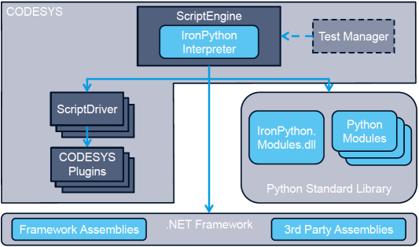

# Architecture of the ScriptEngine, Extension possibilities

The (Iron)Python scripting language used in CODESYS allows for access to the CODESYS Scripting APIs to control CODESYS processes. Moreover, it lets users effectively apply both the Python standard library and third-party Python modules, as well as third-party .NET framework libraries and .NET assemblies.

Users can execute the scripts from menu commands or configured toolbars in the CODESYS interface or from the Windows command line. Add-ons such as the CODESYS Test Manager also provide ways to execute scripts.

With the Automation Platform APIs, the `ScriptEngine` APIs can be extended. Examples for this are CODESYS Test Manager and CODESYS SVN. Both provide their own objects and methods as an extension to the scripting APIs. In addition, the CODESYS Test Manager allows for the execution of scripts in a test case. For more information, see the respective API documentation of the add-ons.

Registered Automation Platform users will find more information in the CODESYS Developer Network.

For more information see: [CODESYS scripting API](../../../../../../api/crossBook?lang=en-US&virtualBookName=ScriptingEngine&topicID=index)

7.0

© Copyright 2026, CODESYS GmbH