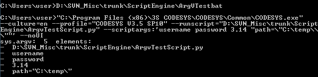

# Starting Scripts from the Command Line

Requirement: A valid Python script file `<file name>.py` is located in the file system.

1. Create a CMD file with the command `start`, the CODESYS starts,

   And with the option --runscript that calls the script file.

   Further options are possible, for example `--noUI`, if the CODESYSuser interface should not be opened.
2. Open the Windows window **Command prompt** and start the CMD file.

You can pass arguments with additional information to the script. Python scripts can access arguments with the `sys.argv[]` list. The first element (Index 0) is always the name or path of the Python script that is executed, followed by the "actual" parameters. (This is similar to `argc`/`argv` in C.)

In addition, scripts can also access environment variables that are set before CODESYS is started with the corresponding Python or .NET APIs.

**Example**

You have a CMD file (batch file) `argvtestbat.cmd` with the following content (all on one line).

```
"C:\Program Files (x86)\CODESYS 3.5.17.0\CODESYS\Common\CODESYS.exe" --profile="CODESYS V3.5 SP17" --runscript="D:\Dokumente\Scripting\ArgvTestScript.py" --scriptargs:'username password 3.14 "path=\"C:\temp\\\""' --noUI
```

You have a matching script file `ArgvTestScript.py`.

```
from __future__ import print_function

import sys
print("sys.argv: ",
   len(sys.argv),
   " elements:")

for arg in sys.argv:
    print(" - ", arg)
```

Now when you execute the CMD file, CODESYS starts and executes the script without opening the CODESYS main window. Then CODESYS is exited:



For a complete reference of all possible command line parameters, see the help page for the command-line interface in CODESYS in the section for "`--runscript`".

For information about the Python API, see: <https://docs.python.org/2/library/os.html#process-parameters>

For information about the .NET API, see: <https://msdn.microsoft.com/de-de/library/77zkk0b6%28v=vs.110%29.aspx>

7.0

© Copyright 2026, CODESYS GmbH