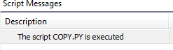

# Creating script calls for a toolbar button

1. Create the `Script Commands` folder in one of the storage locations.

   * ```
     C:\Users\<username>\AppData\Local\CODESYS
     ```
2. Click one of the icons.

   * The following output is displayed in the message view.

     

7.0

© Copyright 2026, CODESYS GmbH