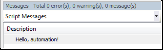

# Getting Started with Python for CODESYS

See below for an simple application of a Python script in CODESYS:

1. In any text editor, create a text file `hello.py` with the following contents:

   `print("Hello, automation!")`
2. Start CODESYS and click **Tools → Scripting → Execute Script File**. Select the file `hello.py` in the file system.

   * See the result in the message view:

     

For more detailed examples of Python scripts for different use cases with CODESYS, see the following help pages.

7.0

© Copyright 2026, CODESYS GmbH