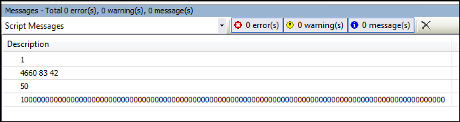
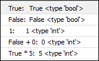

# Numeric types and floating points

In contrast to the dozens of integer types in IEC or C, there is only one integer type in Python. Integer types in Python do not have a fixed size. Instead, they grow as needed and are limited only by available memory.

**Example: `Integers.py`**

```
from __future__ import print_function

i = 1
print(i)

j = 0x1234   # hex number, is 16#1234 in IEC and 4660 in decimal
k = 0o123    # octal number, is 8#123 in IEC and 83 decimal
l = 0b101010 # binary number, is 2#101010 in IEC and 42 in decimal
print(j, k, l)

m = (2 + 3)*10 # k is 50 now
print(m)

n = 10 ** 100 # 10 to the power of 100
print(n)
```

Resulting output:



There is also only one floating-point type in Python which is similar to the IEC data type `LREAL`. It provides 64-bit IEEE floating point arithmetic.

The syntax is like C-based languages for the most part:

**Example: Floating-point types**

```
# A simple float...
a = 123.456

# A float containing the integral value 2
b = 2.

# Leading zeroes can be left off
c = .3 # same as 0.3

# Exponential / scientific representation
d = -123e-5
```

Two special cases are `True` and `False`, two constants that define the Boolean truth values. They behave similar to the integer values `0` and `1`, except when they are converted into strings and return their names.

**Example: `Booleans.py`**

```
# booleans behave like integers, except when converted to strings.
# The built-in function "type" can be used to query the type of a value.
print("True:  ", True, type(True))
print("False: ", False, type(False))
print("1:     ", 1, type(1))
print("False + 0: ", False + 0, type(False + 0))
print("True * 5: ", True * 5, type(True * 5))
```

Resulting output:



7.0

© Copyright 2026, CODESYS GmbH