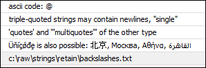

# Strings

In IronPython, strings are always in Unicode and any length. It does not make any difference if they are enclosed in `'` or `"`. Strings can also have triple quotation marks `"""` or `'''`, which allows for multiline string literals.

Similar to C, special characters can be excluded by means of backslash characters. As a comparison, the dollar sign (`$`) is used in IEC for this purpose.

There are also raw strings that have other rules for the backslash. This is practical when the string should have literal backslashes. Example: Windows file paths or regular expressions.

**Example: `Strings.py`**

```
# encoding:utf-8
from __future__ import print_function

a = "a simple string"
b = 'another string'
c = "strings may contain 'quotes' of the other type."
d = "multiple string literals" ' are concatenated ' '''by the parser'''
e = "Escaping: quotes: \" \' backslash: \\ newline: \r\n ascii code: \x40"
f = """triple-quoted strings may contain newlines, "single"
'quotes' and '''multiquotes''' of the other type"""
g = "Üňíçǿđȩ is also possible: 北京, Москва, Αθήνα, القاهرة"
h = r"c:\raw\strings\retain\backslashes.txt"

# we iterate over a sequence of all the variables defined above:
for i in (a,b,c,d,e,f,g,h):
    print(i) # prints the contents of the variable
```

Resulting output:



Python does not have characters types. Characters are expressed by the use of strings with a length of 1. In this way, iteration via a string, or indexing in a string, returns a single-string.

7.0

© Copyright 2026, CODESYS GmbH