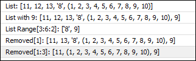

# Lists and tuples (data sets)

Lists and tuples basically correspond to arrays in C and IEC, but there are some noticeable differences:

* The index access is always checked. Accessing a list or a tuple with an invalid index throws an exception.
* Both lists and tuples can contain elements of different types (also other lists and tuples). In contrast in C and IEC, arrays can contain only elements of a single type.
* Lists are dynamic, and elements can be added, removed, or replaced at any time.
* Tuples are not changeable: Once a tuple is created, it cannot be modified anymore.

Lists are created with the `list()` constructor. As an alternative, you can use brackets `[]`. Tuples are created with the `tuple()` constructor or parentheses `()`.

**Example: `list_tuples.py`**

```
from __future__ import print_function
print("Testing tuples and lists")

# We define a tuple with the numbers from 1 to 10:
t = (1, 2, 3, 4, 5, 6, 7, 8, 9, 10)
print("Tuple:", t)

# We can access the 6th element of the tuple.
# As in C, index counting starts with 0.
print("Element 5:", t[5])

# Subscription is more powerful using the range syntax:
print("Range[2:5]:", t[2:5]) # lower bound is inclusive, upper bound is exclusive.
print("Range[2::2]:", t[2::2]) # start with 3rd element, and print every 2nd element.
print("Range[-3:-1]:", t[-3:-1]) # Start with the 3rd last element, end just before the last element (upper bound is exclusive)
print("Range[::-1]:", t[::-1]) # negative step with - print backwards

# lists are similar to tuples...
l = [11, 12, 13, "8", t] # contains mixed types: 3 integers, a string, and the tuple defined above.
print("List:", l)

# ... but elements can be added or removed dynamically.
l.append(9) # Add a 9 to the list.
print("List with 9:", l)
print("List Range[3:6:2]:", l[3:6:2]) # print the 4th and 6th element.

del l[1] # remove the element at index 1, the 12.
print("Removed[1]:", l)
del l[1:3] # Remove the elements at index 1 and 2, the 13 and the '8'.
print("Removed[1:3]:", l)
```

Resulting output:



7.0

© Copyright 2026, CODESYS GmbH